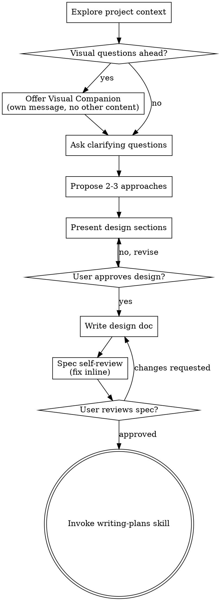

# 把想法 brainstorm 成设计

通过自然的协作式对话，帮助把想法转化为完整成形的设计与 spec。

先从理解当前的项目 context 开始，然后一次问一个问题来打磨想法。一旦你理解了要构建什么，就把设计呈现出来并获得用户批准。

<HARD-GATE>
在你呈现了设计并且用户已经批准之前，**不要**调用任何实现类 skill、不要写任何代码、不要搭建任何项目脚手架、不要采取任何实现性动作。这条规则适用于**每一个**项目，无论它看起来多么简单。
</HARD-GATE>

## 反模式："这太简单了，不需要设计"

每一个项目都要走这个流程。一个 todo list、一个单函数工具、一处 config 改动 —— 全都要。"简单"项目恰恰是未经审视的假设最容易导致工作被白白浪费的地方。设计可以很短（对于真正简单的项目，几句话即可），但你**必须**把它呈现出来并获得批准。

## Checklist

你必须为下列每一项创建一个 task，并按顺序完成它们：

1. **探索项目 context** —— 检查文件、文档、最近的 commit
2. **提供 Visual Companion**（如果话题会涉及视觉问题） —— 这要单独成为一条消息，不要与澄清性问题合并。见下文 Visual Companion 一节。
3. **提出澄清性问题** —— 一次一个，理解目的 / 约束 / 成功标准
4. **提出 2-3 种方案** —— 附带 trade-off 与你的推荐
5. **呈现设计** —— 分节呈现，每节篇幅与其复杂度相称，每节之后获得用户批准
6. **撰写设计文档** —— 保存到 `docs/superpowers/specs/YYYY-MM-DD-<topic>-design.md` 并 commit
7. **Spec 自审** —— 就地快速检查占位符、矛盾、歧义、scope（见下文）
8. **用户审阅书面 spec** —— 在继续之前请用户审阅 spec 文件
9. **过渡到实现** —— 调用 writing-plans skill 来创建实现计划

## 流程图

**终止状态是调用 writing-plans。** 不要调用 frontend-design、mcp-builder 或任何其他实现类 skill。brainstorming 之后**唯一**要调用的 skill 就是 writing-plans。

## 流程

**理解想法：**

- 先了解当前的项目状态（文件、文档、最近的 commit）
- 在问详细问题之前，先评估 scope：如果请求描述了多个相互独立的子系统（例如，"构建一个包含 chat、文件存储、计费和分析的平台"），立刻把这一点指出来。不要把问题花在打磨一个本应先被分解的项目的细节上。
- 如果项目太大，无法装进单一 spec，帮助用户把它分解成子项目：哪些是独立的部分、它们之间如何关联、应该按什么顺序构建？然后通过正常的设计流程对第一个子项目进行 brainstorm。每个子项目都要走自己的 spec → plan → 实现循环。
- 对于 scope 合适的项目，一次问一个问题来打磨想法
- 在可能的情况下优先选择多选题，但开放式问题也可以
- 每条消息只问一个问题 —— 如果一个话题需要进一步探索，就把它拆成多个问题
- 关注理解：目的、约束、成功标准

**探索方案：**

- 提出 2-3 种不同方案及其 trade-off
- 用对话的方式呈现选项，附上你的推荐和理由
- 以你推荐的选项打头，并解释原因

**呈现设计：**

- 一旦你认为自己理解了要构建的东西，就把设计呈现出来
- 每节的篇幅与其复杂度相称：直白的事情几句话即可，有微妙之处的内容最多 200-300 词
- 每节之后询问目前看起来对不对
- 涵盖：架构、组件、data flow、错误处理、测试
- 如果有什么讲不通，做好回头澄清的准备

**为隔离与清晰而设计：**

- 把系统拆成更小的单元，每个单元只有一个明确的目的，通过定义良好的 interface 通信，并且可以独立地被理解和测试
- 对每个单元，你都应该能回答：它做什么、怎么用它、它依赖什么？
- 不读内部实现，别人能理解一个单元做什么吗？你能在不破坏使用方的前提下修改其内部实现吗？如果不能，那么边界还需要再调整。
- 更小、边界更清楚的单元对你工作起来也更轻松 —— 当代码能一次装进 context 时你的推理更好，当文件聚焦时你的编辑也更可靠。当一个文件变得很大时，往往是它做了太多事情的信号。

**在已有代码库里工作：**

- 在提出修改之前先探索当前的结构。沿用已有的 pattern。
- 当已有代码存在影响当前工作的问题（例如，某个文件已经长得太大、边界不清、职责纠缠）时，把有针对性的改进作为设计的一部分纳入进来 —— 就像一个好的开发者在自己工作的代码里所做的那样。
- 不要提出无关的 refactoring。聚焦于服务于当前目标的事情上。

## 设计之后

**文档：**

- 把通过验证的设计（spec）写到 `docs/superpowers/specs/YYYY-MM-DD-<topic>-design.md`
  - （用户对 spec 位置的偏好会覆盖这个默认值）
- 如果可用，使用 elements-of-style:writing-clearly-and-concisely skill
- 把设计文档 commit 到 git

**Spec 自审：**
写完 spec 文档后，用一双新的眼睛重新看它：

1. **占位符扫描：** 是否有任何 "TBD"、"TODO"、不完整的小节或含糊的需求？修掉它们。
2. **内部一致性：** 各小节之间是否相互矛盾？架构是否与 feature 描述匹配？
3. **Scope 检查：** 这是否聚焦到足以用单一实现计划完成？还是需要分解？
4. **歧义检查：** 是否有任何需求可以被解读成两种不同含义？如果有，挑一个并明确写出来。

就地修复任何问题。无需再次自审 —— 修完直接继续。

**用户审阅 Gate：**
spec 自审循环通过后，在继续之前请用户审阅书面 spec：

> "Spec written and committed to `<path>`. Please review it and let me know if you want to make any changes before we start writing out the implementation plan."

等待用户响应。如果他们要求修改，就修改并重新跑一遍 spec 自审循环。只有在用户批准之后才继续。

**实现：**

- 调用 writing-plans skill 来创建详细的实现计划
- 不要调用任何其他 skill。writing-plans 是下一步。

## 关键原则

- **一次一个问题** —— 不要用多个问题压垮对方
- **优先多选题** —— 在可能时比开放式更容易回答
- **无情地 YAGNI** —— 从所有设计中移除不必要的 feature
- **探索备选方案** —— 在敲定之前总是提出 2-3 种方案
- **增量式验证** —— 呈现设计、获得批准后再继续
- **保持灵活** —— 当有什么讲不通时回头澄清

## Visual Companion

一个基于浏览器的 companion，用于在 brainstorm 期间展示 mockup、diagram 与各种视觉选项。它是一个 tool —— 不是一种模式。接受这个 companion 意味着它在那些受益于视觉呈现的问题上可用；这并**不**意味着每个问题都要走浏览器。

**提供 companion：** 当你预期接下来的问题会涉及视觉内容（mockup、layout、diagram）时，提供一次以征得同意：
> "Some of what we're working on might be easier to explain if I can show it to you in a web browser. I can put together mockups, diagrams, comparisons, and other visuals as we go. This feature is still new and can be token-intensive. Want to try it? (Requires opening a local URL)"

**这条提供消息必须独立成为一条消息。** 不要把它与澄清性问题、context 摘要或任何其他内容合并。这条消息应当**只**包含上面的提供文本，别的什么都没有。等用户响应之后再继续。如果他们拒绝，就以纯文本方式继续 brainstorm。

**逐题决策：** 即使用户接受了，也要**对每一个问题**单独决定使用浏览器还是 terminal。判定标准：**用户是看到比读到更容易理解吗？**

- **用浏览器**呈现本身就是视觉性的内容 —— mockup、wireframe、layout 对比、架构 diagram、并排的视觉设计
- **用 terminal** 呈现文本性内容 —— 需求性问题、概念性选择、trade-off 列表、A/B/C/D 文本选项、scope 决策

关于 UI 话题的问题并不自动就是视觉问题。"在这个 context 里 personality 意味着什么？"是概念性问题 —— 用 terminal。"哪种 wizard layout 更好？"是视觉问题 —— 用浏览器。

如果他们同意使用 companion，请在继续之前阅读详细指南：
`skills/brainstorming/visual-companion.md`
