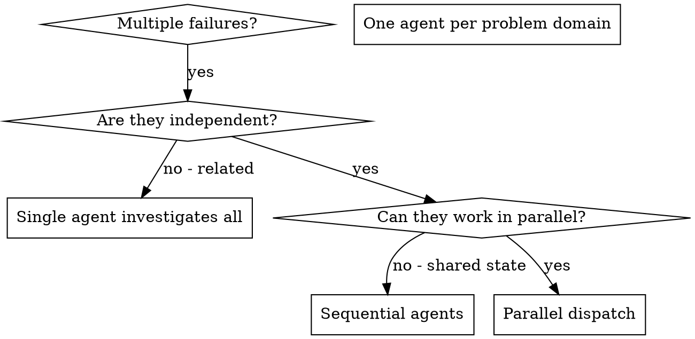

# Dispatching Parallel Agents

## 概述

你将任务委派给具有隔离 context 的专门 agent。通过精确地构造它们的指令和 context，你确保它们专注于任务并取得成功。它们绝不应当继承你 session 的 context 或历史 —— 你要精确构造它们所需的内容。这同时也保留了你自己的 context 用于协调工作。

当你有多个互不相关的失败（不同的测试文件、不同的子系统、不同的 bug），按顺序逐一调查会浪费时间。每一项调查都是独立的，可以并行进行。

**核心原则：** 每一个独立的问题域 dispatch 一个 agent。让它们并发工作。

## 何时使用



**适合使用的场景：**
- 3 个或更多测试文件失败，且根因各不相同
- 多个子系统各自独立地损坏
- 每个问题不需要其他问题的 context 就能理解
- 各项调查之间没有共享状态

**不适合使用的场景：**
- 失败之间彼此相关（修一个可能就修好了其他）
- 需要理解完整的系统状态
- agent 之间会互相干扰

## 模式

### 1. 识别独立的问题域

按"哪里坏了"对失败进行分组：
- 文件 A 的测试：tool 审批流程
- 文件 B 的测试：批量完成行为
- 文件 C 的测试：abort 功能

每个域都是独立的 —— 修复 tool 审批不会影响 abort 测试。

### 2. 创建聚焦的 agent 任务

每个 agent 得到：
- **明确的范围：** 一个测试文件或一个子系统
- **明确的目标：** 让这些测试通过
- **约束：** 不要改动其他代码
- **预期产出：** 你发现了什么、修复了什么的总结

### 3. 并行 dispatch

```typescript
// In Claude Code / AI environment
Task("Fix agent-tool-abort.test.ts failures")
Task("Fix batch-completion-behavior.test.ts failures")
Task("Fix tool-approval-race-conditions.test.ts failures")
// All three run concurrently
```

### 4. 审查并整合

当 agent 返回时：
- 阅读每一份总结
- 验证修复之间不冲突
- 运行完整的测试套件
- 整合所有改动

## Agent Prompt 结构

好的 agent prompt 应当：
1. **聚焦** —— 一个明确的问题域
2. **自包含** —— 包含理解问题所需的全部 context
3. **对输出有明确要求** —— agent 应当返回什么？

```markdown
Fix the 3 failing tests in src/agents/agent-tool-abort.test.ts:

1. "should abort tool with partial output capture" - expects 'interrupted at' in message
2. "should handle mixed completed and aborted tools" - fast tool aborted instead of completed
3. "should properly track pendingToolCount" - expects 3 results but gets 0

These are timing/race condition issues. Your task:

1. Read the test file and understand what each test verifies
2. Identify root cause - timing issues or actual bugs?
3. Fix by:
   - Replacing arbitrary timeouts with event-based waiting
   - Fixing bugs in abort implementation if found
   - Adjusting test expectations if testing changed behavior

Do NOT just increase timeouts - find the real issue.

Return: Summary of what you found and what you fixed.
```

## 常见错误

**❌ 太宽泛：** "Fix all the tests" —— agent 会迷失方向
**✅ 具体明确：** "Fix agent-tool-abort.test.ts" —— 范围聚焦

**❌ 没有 context：** "Fix the race condition" —— agent 不知道在哪里
**✅ 提供 context：** 粘贴错误信息和测试名称

**❌ 没有约束：** agent 可能会重构所有东西
**✅ 设定约束：** "Do NOT change production code" 或 "Fix tests only"

**❌ 输出含糊：** "Fix it" —— 你不知道改了什么
**✅ 明确具体：** "Return summary of root cause and changes"

## 何时**不要**使用

**相关的失败：** 修一个可能就修好了其他 —— 先一起调查
**需要完整 context：** 理解需要看到整个系统
**探索性调试：** 你还不知道哪里坏了
**共享状态：** agent 之间会互相干扰（编辑同一文件、使用同一资源）

## 来自真实 session 的例子

**场景：** 重大重构后，3 个文件中出现了 6 个测试失败

**失败情况：**
- agent-tool-abort.test.ts：3 个失败（timing 问题）
- batch-completion-behavior.test.ts：2 个失败（tool 没有执行）
- tool-approval-race-conditions.test.ts：1 个失败（执行次数 = 0）

**判断：** 互相独立的领域 —— abort 逻辑、批量完成、竞态条件三者彼此分离

**Dispatch：**
```
Agent 1 → Fix agent-tool-abort.test.ts
Agent 2 → Fix batch-completion-behavior.test.ts
Agent 3 → Fix tool-approval-race-conditions.test.ts
```

**结果：**
- Agent 1：用基于事件的等待替换了 timeout
- Agent 2：修复了事件结构的 bug（threadId 位置错了）
- Agent 3：增加了对异步 tool 执行完成的等待

**整合：** 所有修复彼此独立，没有冲突，完整测试套件全绿

**节省的时间：** 3 个问题并行解决，而不是顺序解决

## 主要收益

1. **并行化** —— 多项调查同时进行
2. **聚焦** —— 每个 agent 范围狭窄，需要追踪的 context 更少
3. **独立性** —— agent 之间互不干扰
4. **速度** —— 用 1 个问题的时间解决 3 个问题

## 验证

agent 返回之后：
1. **审查每一份总结** —— 理解改了什么
2. **检查冲突** —— agent 之间是否编辑了同一段代码？
3. **运行完整套件** —— 验证所有修复一起工作
4. **抽查** —— agent 可能会犯系统性的错误

## 真实世界的影响

来自一次调试 session（2025-10-03）：
- 3 个文件中 6 个失败
- 3 个 agent 并行 dispatch
- 所有调查并发完成
- 所有修复成功整合
- agent 改动之间零冲突
