# Sequence Diagrams

时序图展示参与者随时间发生的交互，适合 API 流程、认证时序和系统组件交互。

## Basic Syntax

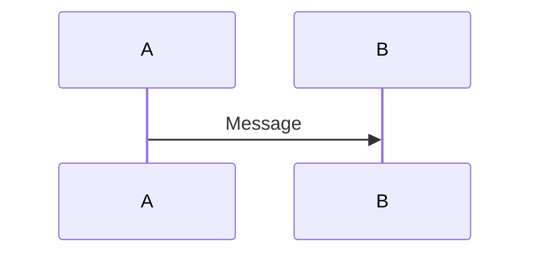
```mermaid
sequenceDiagram
    participant A
    participant B
    A->>B: Message
```

## Participants and Actors

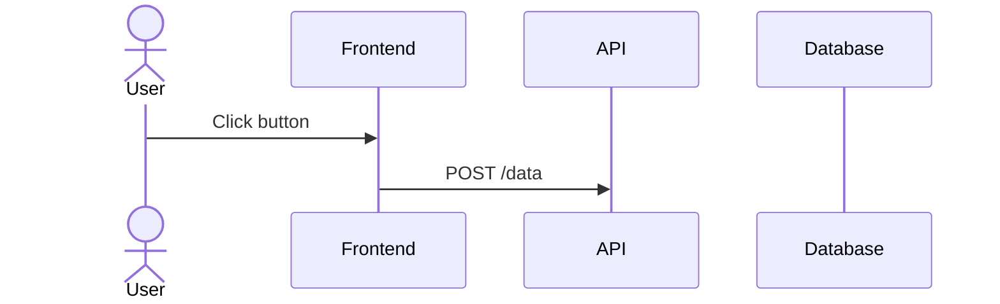
```mermaid
sequenceDiagram
    actor User
    participant Frontend
    participant API
    participant Database
    
    User->>Frontend: Click button
    Frontend->>API: POST /data
```

**区别：**
- `participant` -- 系统组件（服务、类、数据库）
- `actor` -- 外部实体（用户、外部系统）

## Message Types

### Solid Arrow (Synchronous)
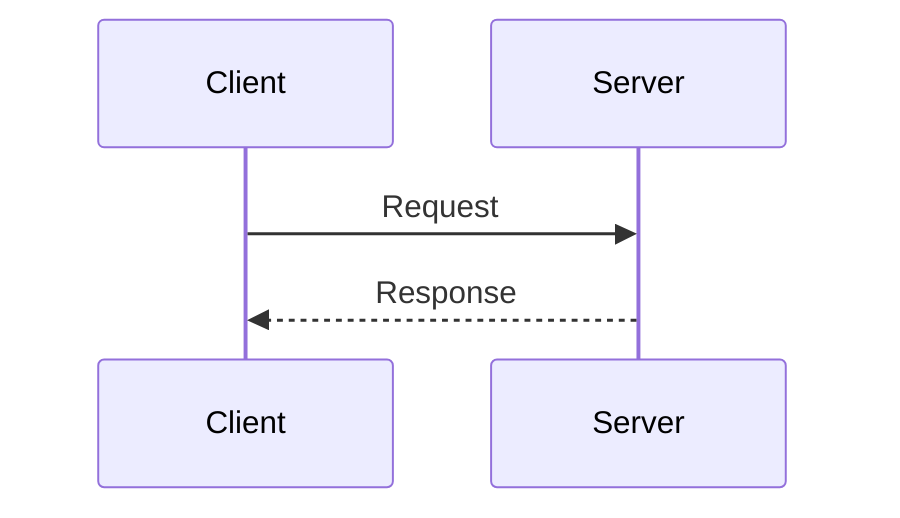
```mermaid
sequenceDiagram
    Client->>Server: Request
    Server-->>Client: Response
```

- `->>`  实线箭头（请求）
- `-->>`  虚线箭头（响应或返回）

### Open Arrow (Asynchronous)
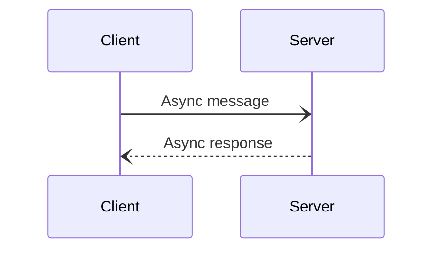
```mermaid
sequenceDiagram
    Client-)Server: Async message
    Server--)Client: Async response
```

- `-)` 实线开放箭头
- `--)` 虚线开放箭头

### Cross/X (Delete)
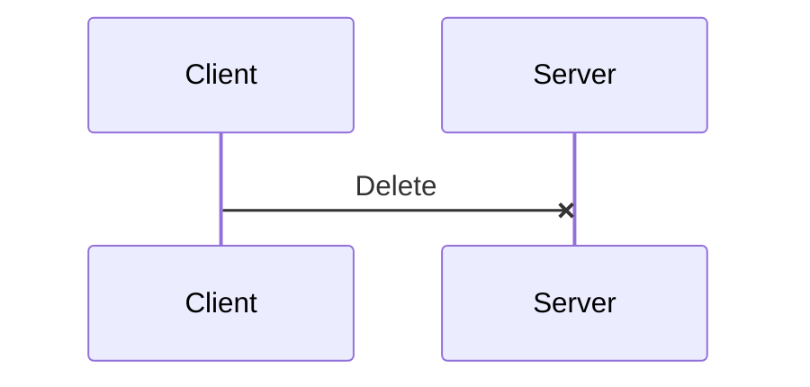
```mermaid
sequenceDiagram
    Client-xServer: Delete
```

## Activations

展示参与者何时正在处理工作：

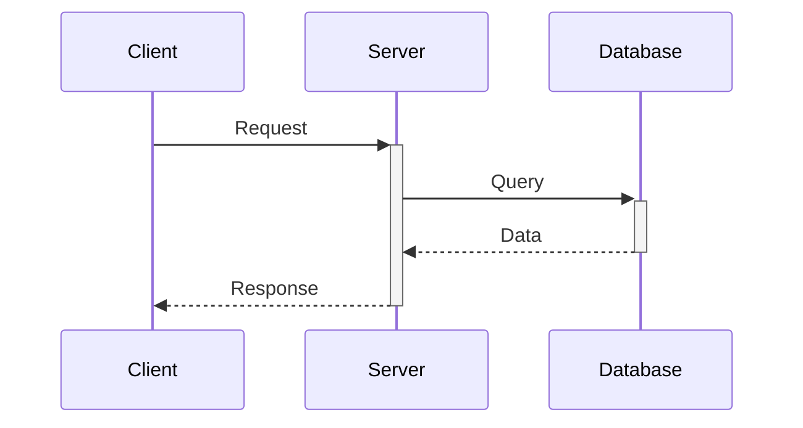
```mermaid
sequenceDiagram
    Client->>+Server: Request
    Server->>+Database: Query
    Database-->>-Server: Data
    Server-->>-Client: Response
```

- 箭头后的 `+` 表示激活
- 箭头前的 `-` 表示取消激活

## Alt/Else (Conditional Logic)

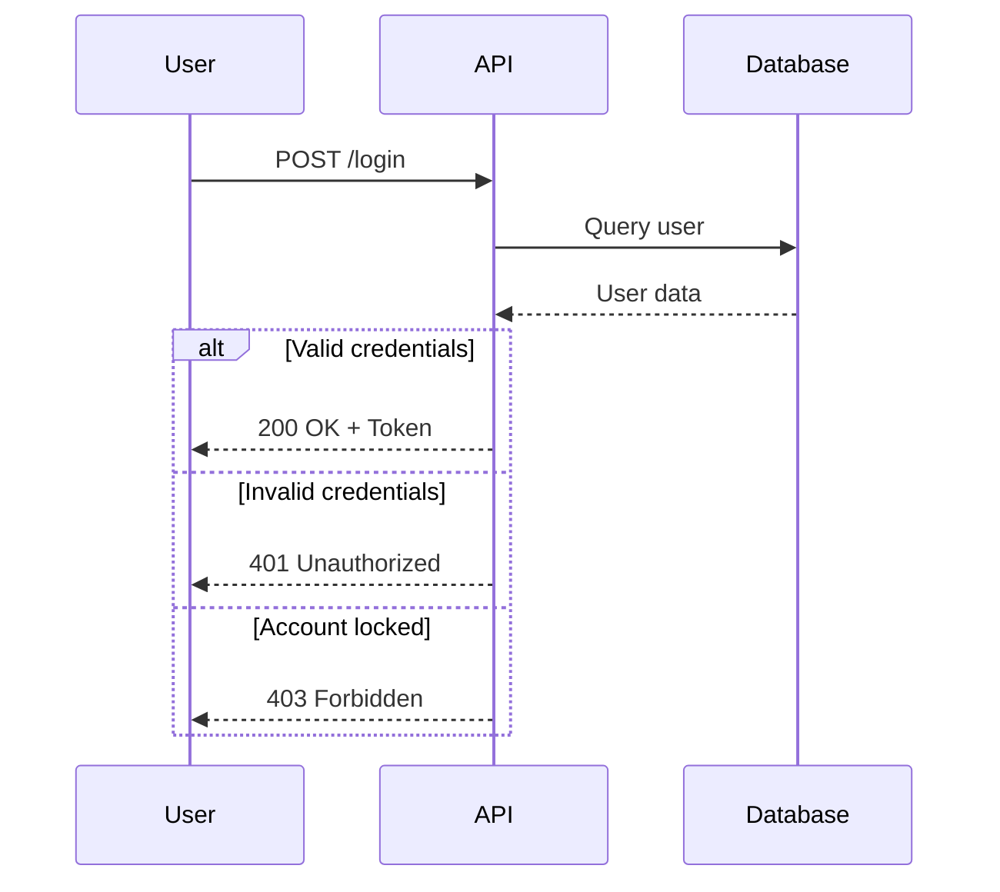
```mermaid
sequenceDiagram
    User->>API: POST /login
    API->>Database: Query user
    Database-->>API: User data
    
    alt Valid credentials
        API-->>User: 200 OK + Token
    else Invalid credentials
        API-->>User: 401 Unauthorized
    else Account locked
        API-->>User: 403 Forbidden
    end
```

## Opt (Optional)

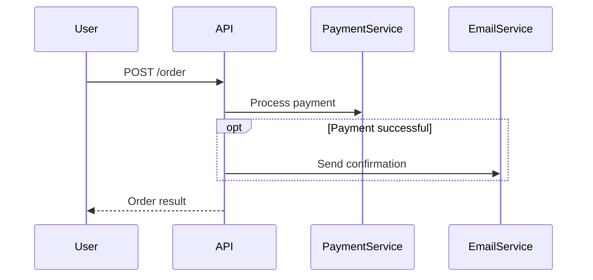
```mermaid
sequenceDiagram
    User->>API: POST /order
    API->>PaymentService: Process payment
    
    opt Payment successful
        API->>EmailService: Send confirmation
    end
    
    API-->>User: Order result
```

## Par (Parallel)

展示并发操作：

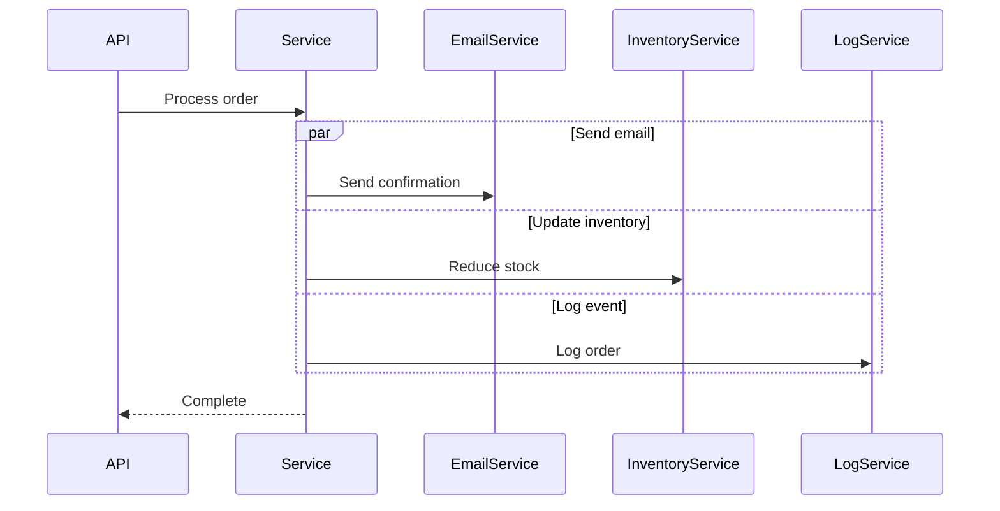
```mermaid
sequenceDiagram
    API->>Service: Process order
    
    par Send email
        Service->>EmailService: Send confirmation
    and Update inventory
        Service->>InventoryService: Reduce stock
    and Log event
        Service->>LogService: Log order
    end
    
    Service-->>API: Complete
```

## Loop

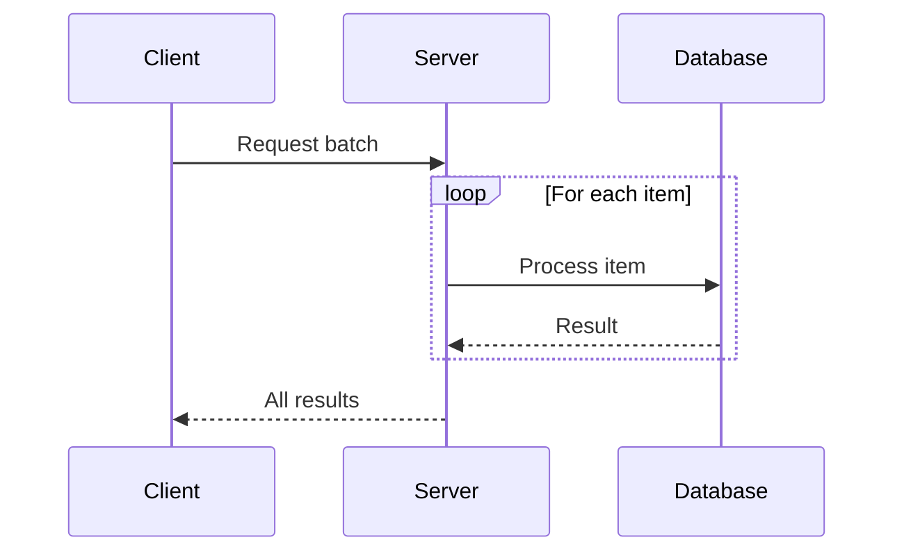
```mermaid
sequenceDiagram
    Client->>Server: Request batch
    
    loop For each item
        Server->>Database: Process item
        Database-->>Server: Result
    end
    
    Server-->>Client: All results
```

**带条件的循环：**
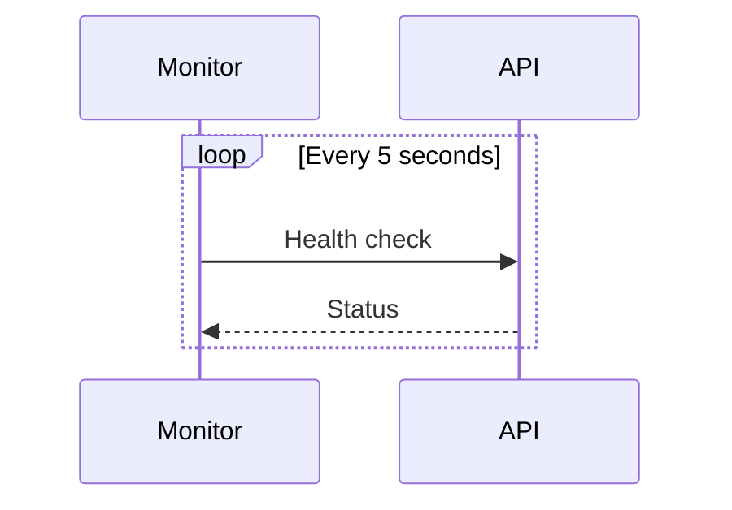
```mermaid
sequenceDiagram
    loop Every 5 seconds
        Monitor->>API: Health check
        API-->>Monitor: Status
    end
```

## Break (Early Exit)

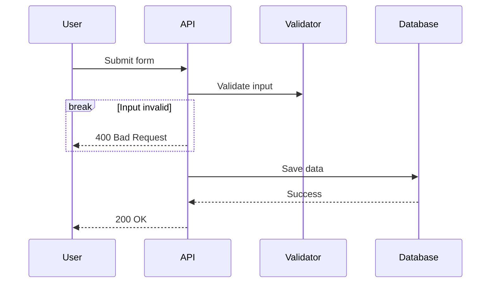
```mermaid
sequenceDiagram
    User->>API: Submit form
    API->>Validator: Validate input
    
    break Input invalid
        API-->>User: 400 Bad Request
    end
    
    API->>Database: Save data
    Database-->>API: Success
    API-->>User: 200 OK
```

## Notes

### Note over single participant
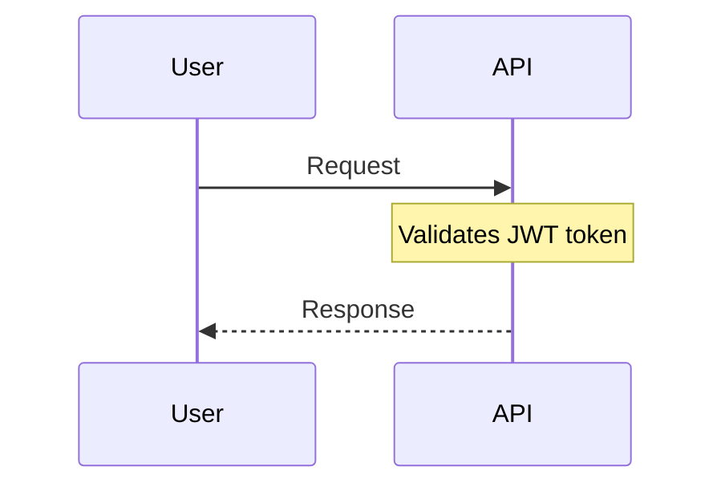
```mermaid
sequenceDiagram
    User->>API: Request
    Note over API: Validates JWT token
    API-->>User: Response
```

### Note spanning participants
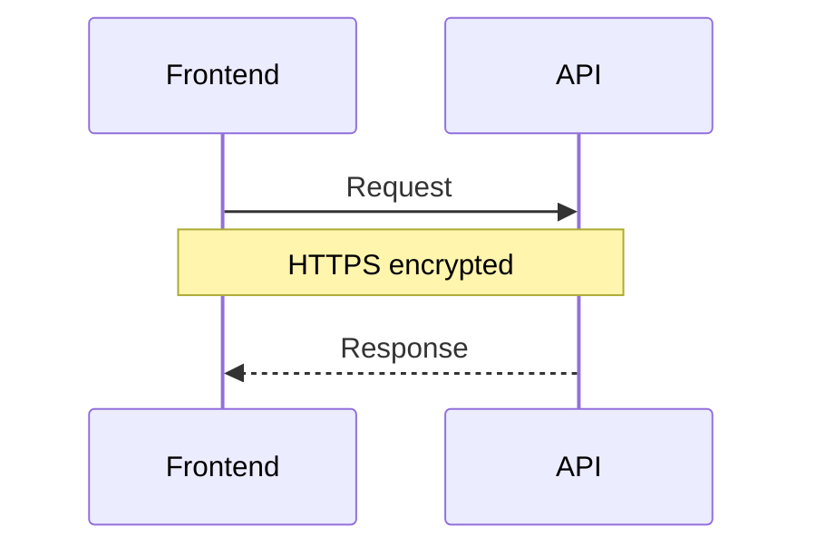
```mermaid
sequenceDiagram
    Frontend->>API: Request
    Note over Frontend,API: HTTPS encrypted
    API-->>Frontend: Response
```

### Right/Left notes
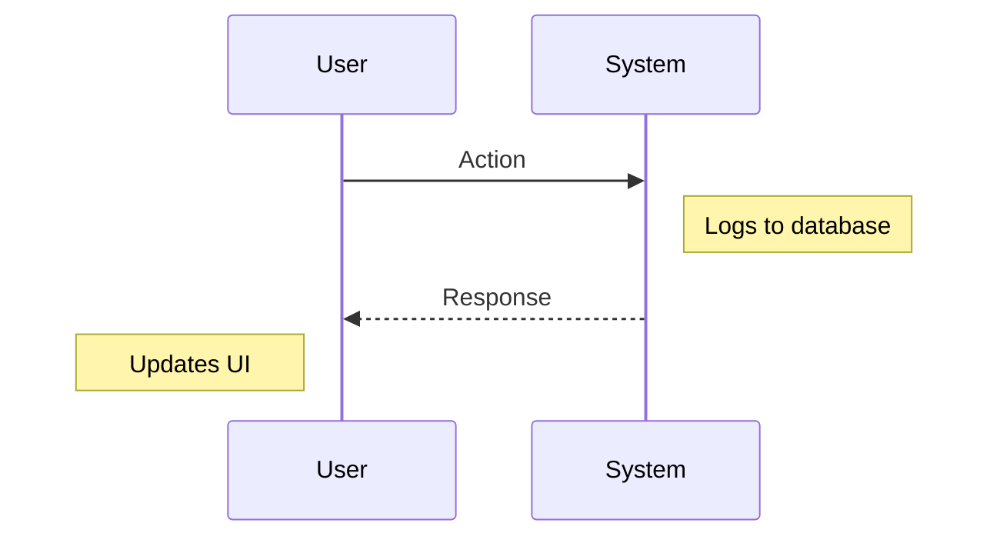
```mermaid
sequenceDiagram
    User->>System: Action
    Note right of System: Logs to database
    System-->>User: Response
    Note left of User: Updates UI
```

## Sequence Numbers

自动为消息编号：

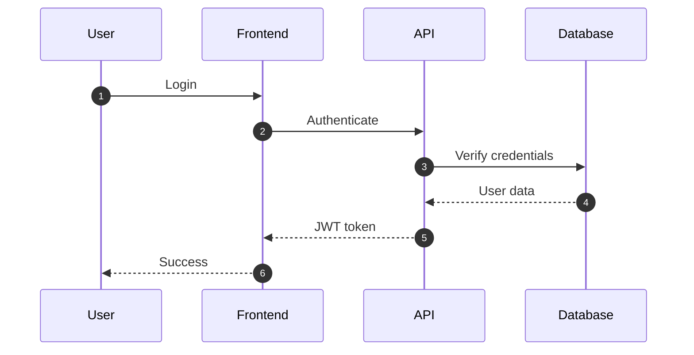
```mermaid
sequenceDiagram
    autonumber
    
    User->>Frontend: Login
    Frontend->>API: Authenticate
    API->>Database: Verify credentials
    Database-->>API: User data
    API-->>Frontend: JWT token
    Frontend-->>User: Success
```

## Links and Tooltips

添加可点击链接：

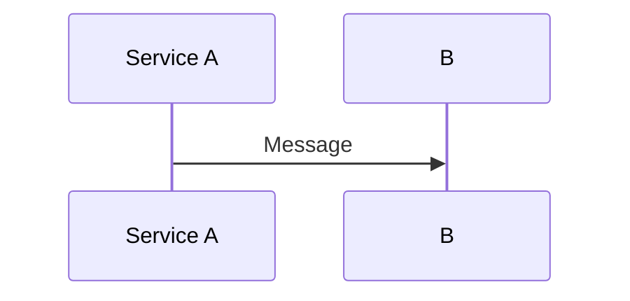
```mermaid
sequenceDiagram
    participant A as Service A
    link A: Dashboard @ https://dashboard.example.com
    link A: API Docs @ https://docs.example.com
    
    A->>B: Message
```

## Comprehensive Example: User Authentication Flow

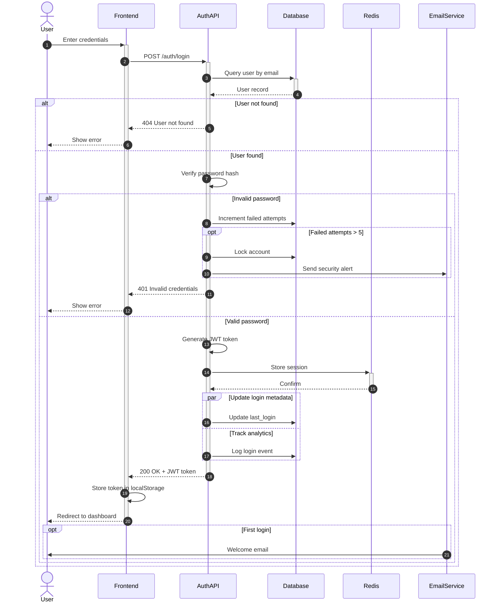
```mermaid
sequenceDiagram
    autonumber
    actor User
    participant Frontend
    participant AuthAPI
    participant Database
    participant Redis
    participant EmailService
    
    User->>+Frontend: Enter credentials
    Frontend->>+AuthAPI: POST /auth/login
    
    AuthAPI->>+Database: Query user by email
    Database-->>-AuthAPI: User record
    
    alt User not found
        AuthAPI-->>Frontend: 404 User not found
        Frontend-->>User: Show error
    else User found
        AuthAPI->>AuthAPI: Verify password hash
        
        alt Invalid password
            AuthAPI->>Database: Increment failed attempts
            
            opt Failed attempts > 5
                AuthAPI->>Database: Lock account
                AuthAPI->>EmailService: Send security alert
            end
            
            AuthAPI-->>Frontend: 401 Invalid credentials
            Frontend-->>User: Show error
        else Valid password
            AuthAPI->>AuthAPI: Generate JWT token
            AuthAPI->>+Redis: Store session
            Redis-->>-AuthAPI: Confirm
            
            par Update login metadata
                AuthAPI->>Database: Update last_login
            and Track analytics
                AuthAPI->>Database: Log login event
            end
            
            AuthAPI-->>-Frontend: 200 OK + JWT token
            Frontend->>Frontend: Store token in localStorage
            Frontend-->>-User: Redirect to dashboard
            
            opt First login
                EmailService->>User: Welcome email
            end
        end
    end
```

## API Request/Response Example

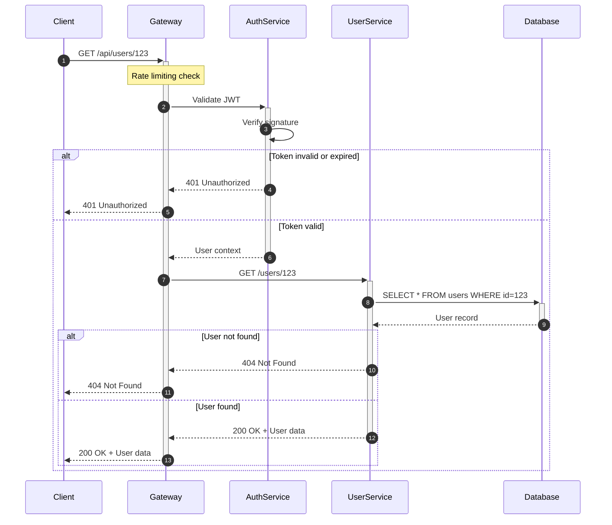
```mermaid
sequenceDiagram
    autonumber
    participant Client
    participant Gateway
    participant AuthService
    participant UserService
    participant Database
    
    Client->>+Gateway: GET /api/users/123
    Note over Gateway: Rate limiting check
    
    Gateway->>+AuthService: Validate JWT
    AuthService->>AuthService: Verify signature
    
    alt Token invalid or expired
        AuthService-->>Gateway: 401 Unauthorized
        Gateway-->>Client: 401 Unauthorized
    else Token valid
        AuthService-->>-Gateway: User context
        
        Gateway->>+UserService: GET /users/123
        UserService->>+Database: SELECT * FROM users WHERE id=123
        Database-->>-UserService: User record
        
        alt User not found
            UserService-->>Gateway: 404 Not Found
            Gateway-->>Client: 404 Not Found
        else User found
            UserService-->>-Gateway: 200 OK + User data
            Gateway-->>-Client: 200 OK + User data
        end
    end
```

## Microservices Communication

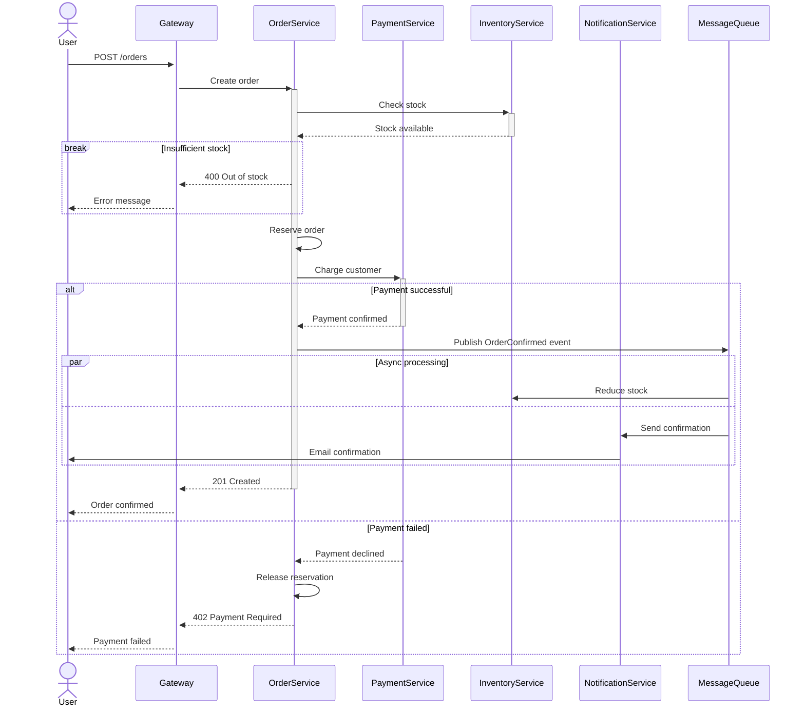
```mermaid
sequenceDiagram
    actor User
    participant Gateway
    participant OrderService
    participant PaymentService
    participant InventoryService
    participant NotificationService
    participant MessageQueue
    
    User->>+Gateway: POST /orders
    Gateway->>+OrderService: Create order
    
    OrderService->>+InventoryService: Check stock
    InventoryService-->>-OrderService: Stock available
    
    break Insufficient stock
        OrderService-->>Gateway: 400 Out of stock
        Gateway-->>User: Error message
    end
    
    OrderService->>OrderService: Reserve order
    OrderService->>+PaymentService: Charge customer
    
    alt Payment successful
        PaymentService-->>-OrderService: Payment confirmed
        OrderService->>MessageQueue: Publish OrderConfirmed event
        
        par Async processing
            MessageQueue->>InventoryService: Reduce stock
        and
            MessageQueue->>NotificationService: Send confirmation
            NotificationService->>User: Email confirmation
        end
        
        OrderService-->>-Gateway: 201 Created
        Gateway-->>User: Order confirmed
    else Payment failed
        PaymentService-->>OrderService: Payment declined
        OrderService->>OrderService: Release reservation
        OrderService-->>Gateway: 402 Payment Required
        Gateway-->>User: Payment failed
    end
```

## Best Practices

1. **合理排列参与者** -- 通常为用户 → 前端 → 后端 → 数据库
2. **使用激活条** -- 显示组件何时正在处理工作
3. **归组相关逻辑** -- 使用 alt/opt/par 组织条件流程
4. **添加说明性注释** -- 解释复杂逻辑或重要细节
5. **保持聚焦** -- 每张图只展示一个场景
6. **为消息编号** -- 复杂流程使用 autonumber
7. **展示错误路径** -- 使用 alt/else 记录失败场景
8. **标记异步操作** -- 对发送后无需等待的消息使用开放箭头

## Common Use Cases

### Authentication
- 登录流程
- OAuth/SSO 流程
- Token 刷新
- 密码重置

### API Operations
- CRUD 操作
- 搜索与筛选
- 批处理
- Webhook 处理

### System Integration
- 微服务通信
- 第三方 API 调用
- 消息队列处理
- 事件驱动架构

### Business Processes
- 订单履约
- 支付处理
- 审批工作流
- 通知链
