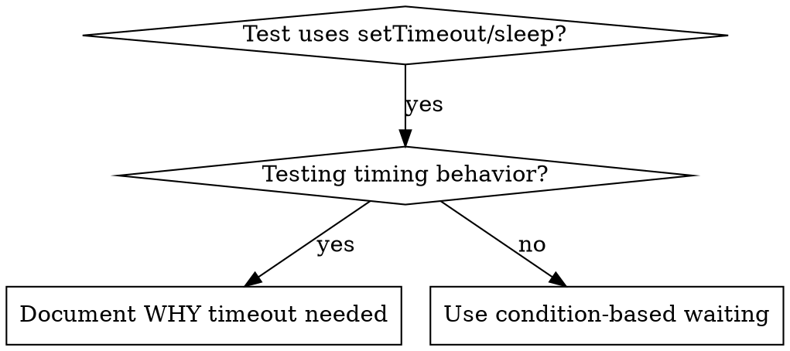

# 基于条件的等待

## 概述

flaky 测试经常通过任意的延时来猜测时序。这会造成 race condition：测试在快速机器上通过，但在负载或 CI 中失败。

**核心原则：** 等待你真正关心的那个条件，而不是猜测它需要多久。

## 何时使用



**适用于：**
- 测试中存在任意延时（`setTimeout`、`sleep`、`time.sleep()`）
- 测试是 flaky 的（有时通过，在负载下失败）
- 并行运行时测试 timeout
- 等待异步操作完成

**不适用于：**
- 测试实际的时序行为（debounce、throttle 间隔）
- 如果使用任意 timeout，始终要写明原因

## 核心模式

```typescript
// ❌ BEFORE: Guessing at timing
await new Promise(r => setTimeout(r, 50));
const result = getResult();
expect(result).toBeDefined();

// ✅ AFTER: Waiting for condition
await waitFor(() => getResult() !== undefined);
const result = getResult();
expect(result).toBeDefined();
```

## 快速模式

| 场景 | 模式 |
|----------|---------|
| 等待事件 | `waitFor(() => events.find(e => e.type === 'DONE'))` |
| 等待状态 | `waitFor(() => machine.state === 'ready')` |
| 等待计数 | `waitFor(() => items.length >= 5)` |
| 等待文件 | `waitFor(() => fs.existsSync(path))` |
| 复合条件 | `waitFor(() => obj.ready && obj.value > 10)` |

## 实现

通用轮询函数：
```typescript
async function waitFor<T>(
  condition: () => T | undefined | null | false,
  description: string,
  timeoutMs = 5000
): Promise<T> {
  const startTime = Date.now();

  while (true) {
    const result = condition();
    if (result) return result;

    if (Date.now() - startTime > timeoutMs) {
      throw new Error(`Timeout waiting for ${description} after ${timeoutMs}ms`);
    }

    await new Promise(r => setTimeout(r, 10)); // Poll every 10ms
  }
}
```

参见本目录下的 `condition-based-waiting-example.ts`，其中包含来自真实 debug 会话的完整实现以及领域特定的辅助函数（`waitForEvent`、`waitForEventCount`、`waitForEventMatch`）。

## 常见错误

**❌ 轮询过快：** `setTimeout(check, 1)` —— 浪费 CPU
**✅ 修复：** 每 10ms 轮询一次

**❌ 没有 timeout：** 如果条件永远不满足，会无限循环
**✅ 修复：** 始终包含 timeout，并给出清晰的错误信息

**❌ 数据陈旧：** 在循环外缓存了状态
**✅ 修复：** 在循环内部调用 getter 以获取最新数据

## 任意 timeout 何时才是正确的

```typescript
// Tool ticks every 100ms - need 2 ticks to verify partial output
await waitForEvent(manager, 'TOOL_STARTED'); // First: wait for condition
await new Promise(r => setTimeout(r, 200));   // Then: wait for timed behavior
// 200ms = 2 ticks at 100ms intervals - documented and justified
```

**要求：**
1. 先等待触发条件
2. 基于已知时序（不是猜测）
3. 用注释说明原因

## 真实影响

来自一次 debug 会话（2025-10-03）：
- 修复了 3 个文件中的 15 个 flaky 测试
- 通过率：60% → 100%
- 执行时间快了 40%
- 不再有 race condition
