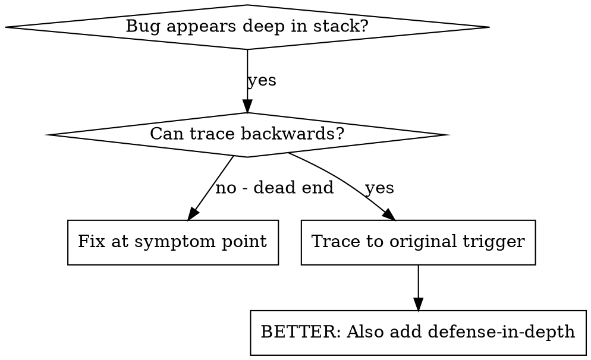
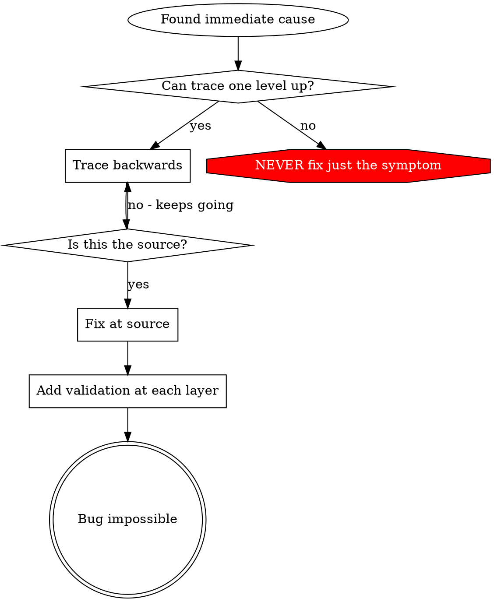

# 根因追溯 / Root Cause Tracing

## 概述

bug 经常在 call stack 深处显现（git init 跑在错误目录、文件创建在错误位置、database 用错误路径打开）。你的本能是在 error 出现的地方修复，但那只是在治标。

**核心原则：** 沿着 call chain 向后追溯，直到找到最初的触发点，然后在源头修复。

## 何时使用



**适用场景：**
- error 发生在执行的深处（而不是入口处）
- stack trace 显示很长的 call chain
- 不清楚无效数据从哪里产生
- 需要找出哪个 test/code 触发了问题

## 追溯流程

### 1. 观察现象
```
Error: git init failed in ~/project/packages/core
```

### 2. 找到直接原因
**哪段 code 直接导致了这个？**
```typescript
await execFileAsync('git', ['init'], { cwd: projectDir });
```

### 3. 追问：是谁调用了它？
```typescript
WorktreeManager.createSessionWorktree(projectDir, sessionId)
  → called by Session.initializeWorkspace()
  → called by Session.create()
  → called by test at Project.create()
```

### 4. 继续向上追溯
**传入了什么值？**
- `projectDir = ''`（空字符串！）
- 空字符串作为 `cwd` 会被解析为 `process.cwd()`
- 那正是源代码目录！

### 5. 找到最初的触发点
**这个空字符串从哪儿来的？**
```typescript
const context = setupCoreTest(); // Returns { tempDir: '' }
Project.create('name', context.tempDir); // Accessed before beforeEach!
```

## 添加 stack trace

当你无法手工追溯时，添加 instrumentation：

```typescript
// Before the problematic operation
async function gitInit(directory: string) {
  const stack = new Error().stack;
  console.error('DEBUG git init:', {
    directory,
    cwd: process.cwd(),
    nodeEnv: process.env.NODE_ENV,
    stack,
  });

  await execFileAsync('git', ['init'], { cwd: directory });
}
```

**关键：** 在 test 中使用 `console.error()`（不要用 logger —— 它可能不会显示）

**运行并捕获：**
```bash
npm test 2>&1 | grep 'DEBUG git init'
```

**分析 stack trace：**
- 寻找 test 文件名
- 找到触发该调用的行号
- 识别模式（同一个 test？同一个 parameter？）

## 定位到底是哪个 test 造成了污染

如果某个东西在 test 期间出现，但你不知道是哪个 test：

使用本目录下的 bisection 脚本 `find-polluter.sh`：

```bash
./find-polluter.sh '.git' 'src/**/*.test.ts'
```

逐个运行 test，在第一个污染者处停下来。具体用法见脚本。

## 真实案例：空的 projectDir

**现象：** `.git` 被创建在 `packages/core/`（源代码目录）

**追溯链：**
1. `git init` 跑在 `process.cwd()` ← cwd parameter 为空
2. WorktreeManager 被调用时 projectDir 为空
3. Session.create() 传入了空字符串
4. test 在 beforeEach 之前就访问了 `context.tempDir`
5. setupCoreTest() 初始时返回 `{ tempDir: '' }`

**根因：** 顶层变量初始化时访问了空值

**修复：** 把 tempDir 改成一个 getter，如果在 beforeEach 之前访问就 throw

**同时增加了 defense-in-depth：**
- 第 1 层：Project.create() 校验目录
- 第 2 层：WorkspaceManager 校验非空
- 第 3 层：NODE_ENV guard 拒绝在 tmpdir 之外执行 git init
- 第 4 层：在 git init 之前打印 stack trace

## 关键原则



**永远不要只在 error 显现的地方修复。** 向后追溯，找到最初的触发点。

## stack trace 小贴士

**在 test 中：** 用 `console.error()` 而不是 logger —— logger 可能被抑制
**在操作之前：** 在危险操作之前打日志，而不是等它失败之后
**包含上下文：** 目录、cwd、environment variables、时间戳
**捕获 stack：** `new Error().stack` 会显示完整的 call chain

## 真实影响

来自一次 debugging session（2025-10-03）：
- 通过 5 层追溯找到了根因
- 在源头修复（getter 校验）
- 增加了 4 层防御
- 1847 个 test 全部通过，零污染
