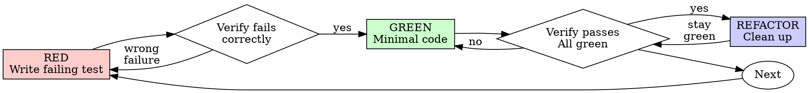

# 测试驱动开发（TDD）

## 概述

先写测试。看着它失败。再写最少的代码让它通过。

**核心原则：** 如果你没有亲眼看到测试失败，你就不知道它测试的是不是正确的东西。

**违反规则的字面含义就是违反规则的精神。**

## 何时使用

**总是使用：**
- 新功能
- bug 修复
- 重构
- 行为变更

**例外（请询问你的人类搭档）：**
- 一次性的 prototype
- 生成的代码
- 配置文件

在想"就这一次跳过 TDD"？停下来。那是合理化。

## 铁律

```
没有先写失败的测试，就不许写生产代码
```

在测试之前写了代码？删掉它。从头开始。

**没有例外：**
- 不要把它留作"参考"
- 不要在写测试时"改编"它
- 不要去看它
- 删除就是删除

从测试出发重新实现。就是这样。

## 红-绿-重构



### RED —— 写一个失败的测试

写一个最小的测试，展示应该发生什么。

<Good>
```typescript
test('retries failed operations 3 times', async () => {
  let attempts = 0;
  const operation = () => {
    attempts++;
    if (attempts < 3) throw new Error('fail');
    return 'success';
  };

  const result = await retryOperation(operation);

  expect(result).toBe('success');
  expect(attempts).toBe(3);
});
```
名字清晰，测试真实的行为，只测一件事
</Good>

<Bad>
```typescript
test('retry works', async () => {
  const mock = jest.fn()
    .mockRejectedValueOnce(new Error())
    .mockRejectedValueOnce(new Error())
    .mockResolvedValueOnce('success');
  await retryOperation(mock);
  expect(mock).toHaveBeenCalledTimes(3);
});
```
名字模糊，测试的是 mock 而不是代码
</Bad>

**要求：**
- 一个行为
- 清晰的名字
- 真实的代码（除非不可避免，否则不用 mock）

### 验证 RED —— 看着它失败

**强制要求。永远不要跳过。**

```bash
npm test path/to/test.test.ts
```

确认：
- 测试失败（不是报错）
- 失败信息符合预期
- 因为功能缺失而失败（不是因为打字错误）

**测试通过了？** 你测的是已有的行为。修正测试。

**测试报错了？** 修掉错误，重新运行直到它正确地失败。

### GREEN —— 最少的代码

写最简单的代码让测试通过。

<Good>
```typescript
async function retryOperation<T>(fn: () => Promise<T>): Promise<T> {
  for (let i = 0; i < 3; i++) {
    try {
      return await fn();
    } catch (e) {
      if (i === 2) throw e;
    }
  }
  throw new Error('unreachable');
}
```
刚好够通过测试
</Good>

<Bad>
```typescript
async function retryOperation<T>(
  fn: () => Promise<T>,
  options?: {
    maxRetries?: number;
    backoff?: 'linear' | 'exponential';
    onRetry?: (attempt: number) => void;
  }
): Promise<T> {
  // YAGNI
}
```
过度设计
</Bad>

不要添加功能、不要重构其他代码、不要在测试要求之外做"改进"。

### 验证 GREEN —— 看着它通过

**强制要求。**

```bash
npm test path/to/test.test.ts
```

确认：
- 测试通过
- 其他测试仍然通过
- 输出干净（没有报错、没有警告）

**测试失败了？** 修代码，不要修测试。

**其他测试失败了？** 现在就修。

### REFACTOR —— 整理

只在 green 之后：
- 消除重复
- 改进命名
- 提取 helper

保持测试为绿。不要添加行为。

### 重复

为下一个功能写下一个失败的测试。

## 好的测试

| 品质 | 好 | 坏 |
|---------|------|-----|
| **最小** | 只测一件事。名字里有"and"？拆开。 | `test('validates email and domain and whitespace')` |
| **清晰** | 名字描述行为 | `test('test1')` |
| **体现意图** | 展示期望的 API | 模糊了代码应该做什么 |

## 顺序为什么重要

**"我会在之后再写测试来验证它能用"**

代码之后写的测试会立刻通过。立刻通过什么也证明不了：
- 可能测错了东西
- 可能测的是实现，而不是行为
- 可能漏掉了你忘记的边界情形
- 你从来没看过它捕捉到 bug

测试先行强迫你看到测试失败，证明它确实在测试某个东西。

**"我已经手动测试过所有边界情形了"**

手动测试是临时的。你以为你测了所有东西，但是：
- 没有记录你测了什么
- 代码变了之后无法重新运行
- 在压力下很容易忘记某些情形
- "我试的时候是好的" ≠ 全面

自动化测试是系统化的。它们每次都以同样的方式运行。

**"删掉 X 小时的工作太浪费了"**

沉没成本谬误。时间已经过去了。你现在的选择是：
- 删掉并用 TDD 重写（再花 X 小时，高信心）
- 留着它再补测试（30 分钟，低信心，很可能有 bug）

"浪费"的是留下你无法信任的代码。没有真正测试的可工作代码就是技术债。

**"TDD 教条主义，务实意味着灵活变通"**

TDD 本身就是务实的：
- 在 commit 之前发现 bug（比之后调试更快）
- 防止回归（测试立刻捕捉到破坏）
- 文档化行为（测试展示如何使用代码）
- 让重构成为可能（自由地修改，测试会捕捉破坏）

"务实"的捷径 = 在生产环境调试 = 更慢。

**"事后补测试也能达到同样的目标 —— 重要的是精神而不是仪式"**

不。事后测试回答"这段代码做什么？"测试先行回答"这段代码应该做什么？"

事后测试会被你的实现带偏。你测试的是你建的东西，而不是需求。你验证的是你记得的边界情形，而不是你发现的。

测试先行强迫你在实现之前发现边界情形。事后测试是验证你记得了所有东西（你并没有）。

事后写 30 分钟测试 ≠ TDD。你得到了覆盖率，失去了"测试有效"的证据。

## 常见的合理化借口

| 借口 | 现实 |
|--------|---------|
| "太简单了不用测" | 简单的代码也会坏。测试只要 30 秒。 |
| "我之后再测" | 立刻通过的测试什么也证明不了。 |
| "事后测试达到同样的目标" | 事后测试 = "这段代码做什么？" 测试先行 = "这段代码应该做什么？" |
| "已经手动测试过了" | 临时的 ≠ 系统化的。没有记录，无法重新运行。 |
| "删 X 小时太浪费" | 沉没成本谬误。留着未经验证的代码是技术债。 |
| "留作参考，先写测试" | 你会去改编它。那就是事后测试。删除就是删除。 |
| "需要先探索一下" | 可以。把探索的结果丢掉，用 TDD 重新开始。 |
| "测试很难 = 设计不清晰" | 听测试的话。难测试 = 难使用。 |
| "TDD 会拖慢我" | TDD 比调试更快。务实 = 测试先行。 |
| "手动测试更快" | 手动测试无法证明边界情形。你每次改动都得重测。 |
| "现有代码没有测试" | 你正在改进它。为现有代码补上测试。 |

## 红色警报 —— 停下并重来

- 在测试之前写了代码
- 在实现之后写测试
- 测试立刻通过
- 无法解释测试为什么失败
- "之后再补"测试
- 合理化"就这一次"
- "我已经手动测试过了"
- "事后测试达到同样的目的"
- "重要的是精神而不是仪式"
- "留作参考"或"改编现有代码"
- "已经花了 X 小时，删了太浪费"
- "TDD 教条主义，我是在务实"
- "这次不一样，因为……"

**所有这些都意味着：删掉代码。用 TDD 重新开始。**

## 示例：bug 修复

**bug：** 接受了空的 email

**RED**
```typescript
test('rejects empty email', async () => {
  const result = await submitForm({ email: '' });
  expect(result.error).toBe('Email required');
});
```

**验证 RED**
```bash
$ npm test
FAIL: expected 'Email required', got undefined
```

**GREEN**
```typescript
function submitForm(data: FormData) {
  if (!data.email?.trim()) {
    return { error: 'Email required' };
  }
  // ...
}
```

**验证 GREEN**
```bash
$ npm test
PASS
```

**REFACTOR**
如有需要，把多个字段的校验抽取出来。

## 验证清单

把工作标记为完成之前：

- [ ] 每一个新函数/方法都有测试
- [ ] 在实现之前看到每一个测试失败了
- [ ] 每个测试都因预期的原因失败（功能缺失，而不是打字错误）
- [ ] 写了最少的代码让每个测试通过
- [ ] 所有测试通过
- [ ] 输出干净（没有报错、没有警告）
- [ ] 测试使用真实的代码（只在不可避免时用 mock）
- [ ] 边界情形和错误已覆盖

不能勾上所有方框？你跳过了 TDD。重新开始。

## 卡住时

| 问题 | 解决方案 |
|---------|----------|
| 不知道怎么测 | 写出你希望的 API。先写断言。问你的人类搭档。 |
| 测试太复杂 | 设计太复杂。简化接口。 |
| 必须 mock 一切 | 代码耦合太紧。使用依赖注入。 |
| 测试 setup 巨大 | 抽取 helper。还是复杂？简化设计。 |

## 与调试的结合

发现 bug？写一个失败的测试复现它。遵循 TDD 循环。这个测试既证明修复有效，又防止回归。

永远不要在没有测试的情况下修 bug。

## 测试反模式

在添加 mock 或测试工具时，请阅读 @testing-anti-patterns.md，避免常见的陷阱：
- 测试 mock 的行为而不是真实的行为
- 给生产类添加只用于测试的方法
- 在不理解依赖的情况下进行 mock

## 最终规则

```
生产代码 → 必须先存在并失败过的测试
否则 → 不是 TDD
```

未经你的人类搭档允许，没有例外。
