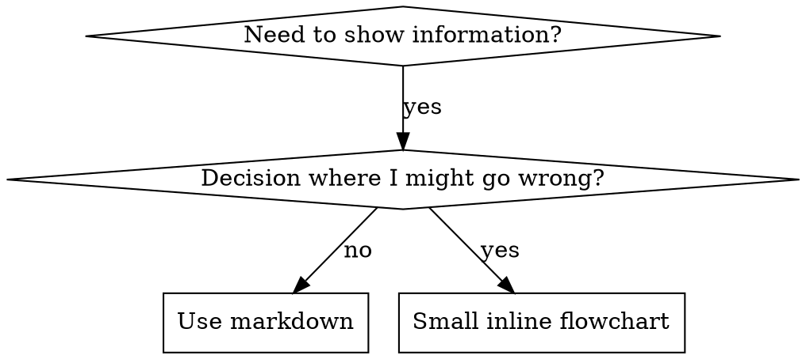

# 编写 Skills

## 概览

**编写 skills 就是把 Test-Driven Development 应用到流程文档上。**

**个人 skills 存放在各个 agent 各自的目录里（Claude Code 的 `~/.claude/skills`，Codex 的 `~/.agents/skills/`）**

你编写测试用例（用 subagent 跑施压场景），看着它失败（基线行为），然后写出 skill（文档），看着测试通过（agent 遵守），再 refactor（堵住漏洞）。

**核心原则：** 如果你没有亲眼看到 agent 在没有 skill 的情况下失败，你就不知道这个 skill 教的是不是对的东西。

**前置背景要求：** 在使用本 skill 之前，你必须理解 superpowers:test-driven-development。那个 skill 定义了基础的 RED-GREEN-REFACTOR 循环。本 skill 是把 TDD 适配到文档上。

**官方指南：** Anthropic 的官方 skill 编写最佳实践，参见 anthropic-best-practices.md。该文档提供了与本 skill 中以 TDD 为核心的方法相补充的额外模式与指南。

## 什么是 Skill？

**skill** 是一份针对成熟技术、模式或工具的参考指南。Skills 帮助未来的 Claude 实例找到并应用有效的方法。

**Skills 是：** 可复用的技术、模式、工具、参考指南

**Skills 不是：** 关于你某次怎么解决某个问题的叙事

## Skills 的 TDD 对应关系

| TDD 概念 | Skill 创建 |
|-------------|----------------|
| **测试用例** | 用 subagent 的施压场景 |
| **生产代码** | Skill 文档（SKILL.md） |
| **测试失败（RED）** | 没有 skill 时 agent 违反规则（基线） |
| **测试通过（GREEN）** | 有 skill 时 agent 遵守规则 |
| **Refactor** | 在保持遵守的同时堵住漏洞 |
| **先写测试** | 在写 skill 之前先跑基线场景 |
| **看着它失败** | 记录 agent 使用的精确合理化说辞 |
| **最少代码** | 写一个针对那些具体违规的 skill |
| **看着它通过** | 验证 agent 现在确实遵守 |
| **Refactor 循环** | 找出新的合理化说辞 → 堵住 → 重新验证 |

整个 skill 创建流程都遵循 RED-GREEN-REFACTOR。

## 何时创建 Skill

**应当创建：**
- 该技术对你来说并非显而易见
- 你会在多个项目中再次参考它
- 该模式具有广泛适用性（不是项目特定）
- 别人也会从中受益

**不应当创建：**
- 一次性的解决方案
- 在别处已经有完善文档的标准做法
- 项目特定的约定（放进 CLAUDE.md）
- 机械性约束（如果可以用 regex / validation 来强制执行，就把它自动化——把文档留给需要判断的事项）

## Skill 类型

### Technique（技术）
带有明确步骤的具体方法（condition-based-waiting、root-cause-tracing）

### Pattern（模式）
思考问题的方式（flatten-with-flags、test-invariants）

### Reference（参考）
API 文档、语法指南、工具文档（office docs）

## 目录结构


```
skills/
  skill-name/
    SKILL.md              # 主参考（必需）
    supporting-file.*     # 仅在需要时
```

**扁平命名空间** —— 所有 skills 都在一个可搜索的命名空间里

**单独成文件的情况：**
1. **大量参考资料**（100+ 行）—— API 文档、完整语法
2. **可复用工具** —— 脚本、工具、模板

**保留在内联的：**
- 原则与概念
- 代码模式（< 50 行）
- 其他一切

## SKILL.md 结构

**Frontmatter（YAML）：**
- 两个必填字段：`name` 和 `description`（所有受支持的字段见 [agentskills.io/specification](https://agentskills.io/specification)）
- 总长度最多 1024 个字符
- `name`：仅使用字母、数字和连字符（不要括号、特殊字符）
- `description`：第三人称，仅描述何时使用（不描述它做什么）
  - 以 "Use when..." 开头，聚焦于触发条件
  - 包含具体的症状、情境与上下文
  - **绝不要总结 skill 的流程或 workflow**（原因见 CSO 部分）
  - 如果可能，控制在 500 字符以内

```markdown
---
name: Skill-Name-With-Hyphens
description: Use when [specific triggering conditions and symptoms]
---

# Skill 名称

## 概览
这是什么？用 1-2 句话说明核心原则。

## 何时使用
[只有当决策不显而易见时才放一个小型内联 flowchart]

带 SYMPTOMS 与使用场景的 bullet 列表
何时不要使用

## 核心模式（用于 techniques/patterns）
Before/after 的代码对比

## 快速参考
便于扫读的常见操作表格或 bullets

## 实现
简单模式直接内联代码
大量参考或可复用工具则链接到文件

## 常见错误
哪里会出问题以及如何修复

## 真实世界影响（可选）
具体的成果
```


## Claude Search Optimization（CSO）

**对发现至关重要：** 未来的 Claude 需要能够找到你的 skill

### 1. 丰富的 description 字段

**目的：** Claude 通过 description 来决定为某个任务加载哪些 skills。让它能回答："我现在该不该读这个 skill？"

**格式：** 以 "Use when..." 开头，聚焦于触发条件

**关键：description = 何时使用，而不是 skill 做什么**

description 应当只描述触发条件。不要在 description 里总结 skill 的流程或 workflow。

**为什么这件事很重要：** 测试发现，当 description 总结了 skill 的 workflow 时，Claude 可能会按 description 行事而不去读完整的 skill 内容。一个写着 "code review between tasks" 的 description，导致 Claude 只做了一次 review，尽管该 skill 的 flowchart 明确写出了两次 review（先做规范符合性 review，再做代码质量 review）。

当 description 改为只写 "Use when executing implementation plans with independent tasks"（不带 workflow 总结）后，Claude 正确地读取了 flowchart 并遵循了两阶段的 review 流程。

**陷阱：** 总结了 workflow 的 description 会制造一条 Claude 会走的捷径，导致 skill 正文变成 Claude 跳过的文档。

```yaml
# ❌ BAD: 总结了 workflow —— Claude 可能照此行事而不去读 skill
description: Use when executing plans - dispatches subagent per task with code review between tasks

# ❌ BAD: 流程细节太多
description: Use for TDD - write test first, watch it fail, write minimal code, refactor

# ✅ GOOD: 仅触发条件，不总结 workflow
description: Use when executing implementation plans with independent tasks in the current session

# ✅ GOOD: 仅触发条件
description: Use when implementing any feature or bugfix, before writing implementation code
```

**内容：**
- 使用具体的触发点、症状与情境，标志着此 skill 适用
- 描述*问题*（race conditions、不一致行为）而不是*某种语言特有的症状*（setTimeout、sleep）
- 除非 skill 本身就是技术特定的，否则保持触发条件与具体技术无关
- 如果 skill 是技术特定的，就在触发条件里写明
- 用第三人称写（会被注入到 system prompt 中）
- **绝不要总结 skill 的流程或 workflow**

```yaml
# ❌ BAD: 太抽象、太模糊，没说何时使用
description: For async testing

# ❌ BAD: 第一人称
description: I can help you with async tests when they're flaky

# ❌ BAD: 提到了某项技术，但 skill 并不是该技术专用
description: Use when tests use setTimeout/sleep and are flaky

# ✅ GOOD: 以 "Use when" 开头，描述问题，不带 workflow
description: Use when tests have race conditions, timing dependencies, or pass/fail inconsistently

# ✅ GOOD: 技术特定的 skill 带显式触发条件
description: Use when using React Router and handling authentication redirects
```

### 2. 关键词覆盖

使用 Claude 会搜索的词：
- 错误信息："Hook timed out"、"ENOTEMPTY"、"race condition"
- 症状："flaky"、"hanging"、"zombie"、"pollution"
- 同义词："timeout/hang/freeze"、"cleanup/teardown/afterEach"
- 工具：实际的命令、库名、文件类型

### 3. 描述性命名

**用主动语态，动词在前：**
- ✅ `creating-skills` 而不是 `skill-creation`
- ✅ `condition-based-waiting` 而不是 `async-test-helpers`

### 4. Token 效率（关键）

**问题：** getting-started 以及频繁被引用的 skills 会被加载进每一次对话。每个 token 都要计较。

**目标字数：**
- getting-started workflows：每个 <150 词
- 频繁加载的 skills：总共 <200 词
- 其他 skills：<500 词（仍然要简洁）

**技巧：**

**把细节挪到工具的 help 里：**
```bash
# ❌ BAD: 在 SKILL.md 里写出所有 flag
search-conversations supports --text, --both, --after DATE, --before DATE, --limit N

# ✅ GOOD: 引用 --help
search-conversations supports multiple modes and filters. Run --help for details.
```

**使用 cross-references：**
```markdown
# ❌ BAD: 重复 workflow 细节
When searching, dispatch subagent with template...
[20 lines of repeated instructions]

# ✅ GOOD: 引用其他 skill
Always use subagents (50-100x context savings). REQUIRED: Use [other-skill-name] for workflow.
```

**压缩示例：**
```markdown
# ❌ BAD: 啰嗦的示例（42 词）
your human partner: "How did we handle authentication errors in React Router before?"
You: I'll search past conversations for React Router authentication patterns.
[Dispatch subagent with search query: "React Router authentication error handling 401"]

# ✅ GOOD: 极简示例（20 词）
Partner: "How did we handle auth errors in React Router?"
You: Searching...
[Dispatch subagent → synthesis]
```

**消除冗余：**
- 不要重复 cross-referenced skills 里已有的内容
- 不要解释从命令本身就显而易见的内容
- 不要为同一个模式写多个示例

**校验：**
```bash
wc -w skills/path/SKILL.md
# getting-started workflows: 目标每个 <150
# 其他频繁加载的: 总共 <200
```

**按你做的事或核心洞见命名：**
- ✅ `condition-based-waiting` > `async-test-helpers`
- ✅ `using-skills` 而不是 `skill-usage`
- ✅ `flatten-with-flags` > `data-structure-refactoring`
- ✅ `root-cause-tracing` > `debugging-techniques`

**动名词（-ing）适合流程类：**
- `creating-skills`、`testing-skills`、`debugging-with-logs`
- 主动，描述了你正在执行的动作

### 4. 引用其他 Skills

**当你写的文档引用其他 skills 时：**

只用 skill 名，并加上明确的要求标记：
- ✅ Good: `**REQUIRED SUB-SKILL:** Use superpowers:test-driven-development`
- ✅ Good: `**REQUIRED BACKGROUND:** You MUST understand superpowers:systematic-debugging`
- ❌ Bad: `See skills/testing/test-driven-development`（不清楚是否必需）
- ❌ Bad: `@skills/testing/test-driven-development/SKILL.md`（会强制加载，烧 context）

**为什么不要用 @ 链接：** `@` 语法会立即强制加载文件，在你需要它之前就消耗掉 200k+ context。

## Flowchart 用法



**仅在以下情形使用 flowchart：**
- 不显而易见的决策点
- 你可能过早停下的流程循环
- "何时用 A 还是 B" 的决策

**绝不要把 flowchart 用于：**
- 参考资料 → 表格、列表
- 代码示例 → Markdown 代码块
- 线性指令 → 编号列表
- 没有语义意义的标签（step1、helper2）

graphviz 风格规则参见 @graphviz-conventions.dot。

**给你的人类伙伴可视化：** 使用本目录下的 `render-graphs.js` 把某个 skill 的 flowcharts 渲染为 SVG：
```bash
./render-graphs.js ../some-skill           # 每张图分别渲染
./render-graphs.js ../some-skill --combine # 所有图合并为一张 SVG
```

## 代码示例

**一个出色的示例胜过许多平庸的示例**

选择最相关的语言：
- 测试技术 → TypeScript/JavaScript
- 系统调试 → Shell/Python
- 数据处理 → Python

**好的示例：**
- 完整且可运行
- 注释充分，解释 WHY
- 来自真实场景
- 清晰展示模式
- 可直接拿来改用（不是通用模板）

**不要：**
- 用 5+ 种语言来实现
- 创建填空式模板
- 写做作的示例

你擅长移植 —— 一个出色的示例就够了。

## 文件组织

### 自包含的 Skill
```
defense-in-depth/
  SKILL.md    # 全部内联
```
适用：所有内容都放得下，不需要大量参考材料

### 带可复用工具的 Skill
```
condition-based-waiting/
  SKILL.md    # 概览 + 模式
  example.ts  # 可改用的工作示例 helpers
```
适用：工具是可复用的代码，而不仅是叙事

### 带大量参考材料的 Skill
```
pptx/
  SKILL.md       # 概览 + workflows
  pptxgenjs.md   # 600 行 API 参考
  ooxml.md       # 500 行 XML 结构
  scripts/       # 可执行工具
```
适用：参考材料太大，不适合内联

## 铁律（与 TDD 相同）

```
没有失败的测试，就不写 skill
```

这条对**新建** skill 和**编辑**已有 skill 都适用。

先写 skill 再测试？删掉。重来。
不测试就编辑 skill？同样违规。

**没有例外：**
- "简单的添加" 也不行
- "只是加一段" 也不行
- "文档更新" 也不行
- 不要把未经测试的修改作为 "参考" 留着
- 不要在跑测试的同时 "改一改"
- 删除就是删除

**前置背景要求：** superpowers:test-driven-development skill 解释了为什么这件事重要。同样的原则适用于文档。

## 测试所有类型的 Skill

不同类型的 skill 需要不同的测试方式：

### 强制纪律的 Skills（规则/要求）

**例子：** TDD、verification-before-completion、designing-before-coding

**测试方式：**
- 学术性问题：他们理解规则吗？
- 施压场景：他们在压力下能否遵守？
- 多重压力叠加：时间 + 沉没成本 + 疲惫
- 找出合理化说辞，并加上明确的反驳

**成功标准：** Agent 在最大压力下仍遵守规则

### 技术 Skills（how-to 指南）

**例子：** condition-based-waiting、root-cause-tracing、defensive-programming

**测试方式：**
- 应用场景：他们能否正确应用该技术？
- 变体场景：他们能否处理边界情况？
- 缺失信息测试：说明里有没有空缺？

**成功标准：** Agent 能成功把该技术应用到新场景

### 模式 Skills（mental models）

**例子：** reducing-complexity、information-hiding 概念

**测试方式：**
- 识别场景：他们能识别出何时该应用此模式吗？
- 应用场景：他们能否使用该 mental model？
- 反例：他们知道何时**不**应用吗？

**成功标准：** Agent 能正确识别何时/如何应用该模式

### 参考 Skills（文档/API）

**例子：** API 文档、命令参考、库指南

**测试方式：**
- 检索场景：他们能找到正确的信息吗？
- 应用场景：他们能否正确使用所找到的信息？
- 缺口测试：常见使用场景是否都覆盖到了？

**成功标准：** Agent 能找到并正确应用参考信息

## 跳过测试的常见合理化说辞

| 借口 | 现实 |
|--------|---------|
| "这个 skill 显然清楚" | 你觉得清楚 ≠ 别的 agent 觉得清楚。测一下。 |
| "这只是个参考" | 参考也会有缺口、不清晰的部分。测试检索。 |
| "测试太过头了" | 未经测试的 skill 一定会有问题。15 分钟测试能省下数小时。 |
| "等出问题再测" | 出问题 = agents 用不了这个 skill。在部署**之前**测试。 |
| "测起来太繁琐" | 测试比之后调试一个糟糕的 skill 在生产环境里出问题更轻松。 |
| "我有信心这是好的" | 过度自信保证会出问题。还是测一下。 |
| "学术性 review 就够了" | 阅读 ≠ 使用。测试应用场景。 |
| "没时间测" | 部署未经测试的 skill 之后会浪费更多时间去修。 |

**所有这些都意味着：在部署之前测试。没有例外。**

## 让 Skills 经得起合理化攻击

那些强制纪律的 skills（比如 TDD）需要能抵御合理化。Agents 很聪明，在压力下会找漏洞。

**心理学说明：** 理解说服技术为什么有效，能帮助你系统地应用它们。研究基础（Cialdini, 2021；Meincke et al., 2025）关于 authority、commitment、scarcity、social proof 与 unity 原则，参见 persuasion-principles.md。

### 显式堵住每一个漏洞

不要只声明规则 —— 要禁止具体的绕路：

<Bad>
```markdown
Write code before test? Delete it.
```
</Bad>

<Good>
```markdown
Write code before test? Delete it. Start over.

**No exceptions:**
- Don't keep it as "reference"
- Don't "adapt" it while writing tests
- Don't look at it
- Delete means delete
```
</Good>

### 应对 "精神 vs 字面" 之争

尽早加上一条基础原则：

```markdown
**Violating the letter of the rules is violating the spirit of the rules.**
```

这就切断了一整类 "我是在遵守精神" 的合理化说辞。

### 构建合理化说辞表

把基线测试中捕获的合理化说辞（见下文 Testing 部分）记下来。agents 提出的每一个借口都进表：

```markdown
| Excuse | Reality |
|--------|---------|
| "Too simple to test" | Simple code breaks. Test takes 30 seconds. |
| "I'll test after" | Tests passing immediately prove nothing. |
| "Tests after achieve same goals" | Tests-after = "what does this do?" Tests-first = "what should this do?" |
```

### 创建红旗清单

让 agents 在合理化时容易自我检查：

```markdown
## Red Flags - STOP and Start Over

- Code before test
- "I already manually tested it"
- "Tests after achieve the same purpose"
- "It's about spirit not ritual"
- "This is different because..."

**All of these mean: Delete code. Start over with TDD.**
```

### 在 CSO 中加入违规症状

把以下内容加进 description：你**即将**违反规则时的症状：

```yaml
description: use when implementing any feature or bugfix, before writing implementation code
```

## Skills 的 RED-GREEN-REFACTOR

遵循 TDD 循环：

### RED：写一个失败的测试（基线）

在**没有** skill 的情况下用 subagent 跑施压场景。记录精确行为：
- 他们做了什么选择？
- 他们用了什么合理化说辞（逐字记录）？
- 哪些压力触发了违规？

这就是 "看着测试失败" —— 你必须先看见 agents 在自然状态下做什么，再写 skill。

### GREEN：写最少必要的 skill

写出针对那些具体合理化说辞的 skill。不要为假设性情况添加额外内容。

带着 skill 再跑同一组场景。Agent 现在应当遵守。

### REFACTOR：堵住漏洞

Agent 找到了新的合理化说辞？加上明确的反驳。重新测试，直到无懈可击。

**测试方法论：** 完整的测试方法论参见 @testing-skills-with-subagents.md：
- 如何写施压场景
- 压力类型（时间、沉没成本、authority、疲惫）
- 系统地堵漏
- Meta-testing 技巧

## 反模式

### ❌ 叙事式示例
"在 2025-10-03 那个会话里，我们发现空的 projectDir 导致了……"
**为什么糟糕：** 太特殊，不可复用

### ❌ 多语言稀释
example-js.js、example-py.py、example-go.go
**为什么糟糕：** 质量平庸，维护负担

### ❌ 在 flowchart 里写代码
```dot
step1 [label="import fs"];
step2 [label="read file"];
```
**为什么糟糕：** 没法 copy-paste，难读

### ❌ 通用标签
helper1、helper2、step3、pattern4
**为什么糟糕：** 标签应当带语义意义

## 停一下：在转向下一个 skill 之前

**写完任何一个 skill 之后，你必须停下来，完成完整的部署流程。**

**不要：**
- 批量创建多个 skill 而不挨个测试
- 在当前 skill 经过验证之前就转向下一个
- 因为 "批处理更高效" 就跳过测试

**下方的部署 checklist 对每一个 skill 都是强制性的。**

部署未经测试的 skills = 部署未经测试的代码。这是对质量标准的违反。

## Skill 创建 checklist（TDD 适配版）

**重要：使用 TodoWrite 为下方 checklist 的**每一项**创建 todo。**

**RED 阶段 —— 写失败的测试：**
- [ ] 创建施压场景（纪律类 skills 至少叠加 3 种压力）
- [ ] 在**不带** skill 的情况下跑场景 —— 逐字记录基线行为
- [ ] 识别合理化说辞 / 失败模式

**GREEN 阶段 —— 写最少必要的 skill：**
- [ ] 名字仅使用字母、数字、连字符（不要括号 / 特殊字符）
- [ ] YAML frontmatter 含必填字段 `name` 与 `description`（最多 1024 字符；见 [spec](https://agentskills.io/specification)）
- [ ] description 以 "Use when..." 开头，并包含具体的触发条件 / 症状
- [ ] description 用第三人称写
- [ ] 全文带利于搜索的关键词（错误、症状、工具）
- [ ] 概览清晰，包含核心原则
- [ ] 针对在 RED 阶段识别出的具体基线失败做出回应
- [ ] 代码内联，或链接到独立文件
- [ ] 一个出色的示例（不是多语言）
- [ ] 带着 skill 跑场景 —— 验证 agents 现在确实遵守

**REFACTOR 阶段 —— 堵住漏洞：**
- [ ] 从测试中识别**新的**合理化说辞
- [ ] 加上明确的反驳（如果是纪律类 skill）
- [ ] 把所有测试迭代中的内容汇总成合理化说辞表
- [ ] 创建红旗清单
- [ ] 重新测试直至无懈可击

**质量检查：**
- [ ] 仅在决策不显而易见时才放小型 flowchart
- [ ] 快速参考表格
- [ ] 常见错误一节
- [ ] 没有叙事式讲故事
- [ ] supporting 文件仅用于工具或大量参考

**部署：**
- [ ] 把 skill commit 进 git，并推送到你的 fork（如已配置）
- [ ] 考虑通过 PR 回馈（如果对大家普遍有用）

## 发现 workflow

未来的 Claude 如何找到你的 skill：

1. **遇到问题**（"tests are flaky"）
3. **找到 SKILL**（description 匹配）
4. **扫读概览**（这个相关吗？）
5. **阅读模式**（快速参考表）
6. **加载示例**（仅在实现时）

**为这一流程做优化** —— 把可搜索的词放在前面、放得多。

## 底线

**创建 skills 就是为流程文档做 TDD。**

同样的铁律：没有失败的测试就不写 skill。
同样的循环：RED（基线）→ GREEN（写 skill）→ REFACTOR（堵漏洞）。
同样的收益：质量更好，意外更少，结果坚不可摧。

如果你为代码遵循 TDD，那就为 skills 遵循 TDD。这是同一种纪律应用到文档上。
