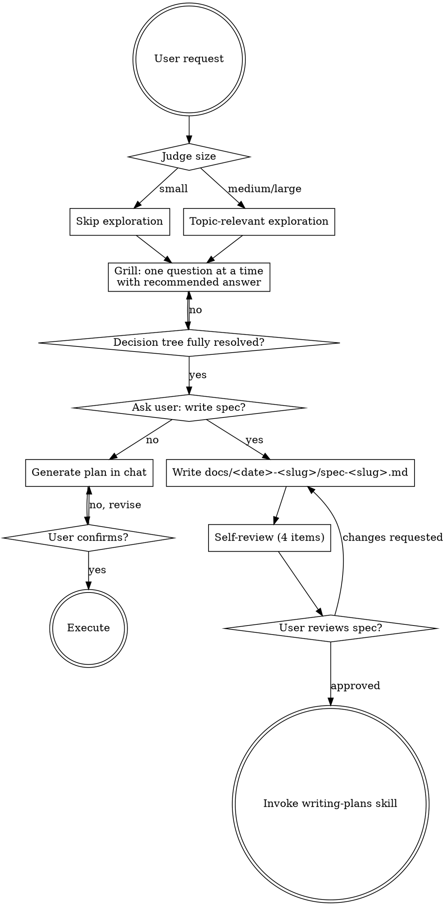

# scope —— 把需求拷问清楚

## 概览

scope 是几乎所有需求开始前的默认入口。它结合了**协作式探索**与**对抗式 grill** 两种气质：先快速理解项目当前状态与需求规模，然后通过决策树式的连续提问把每个未决策点榨干。每一题都给出推荐答案，让用户从"创造者"变成"审核者"，把决策成本降到最低。

scope 走完后，产物是对话里达成的"已确认决策集合"。然后由用户选择两条出口之一：**对话内直接生成 plan 立即执行**（轻量任务），或**落成 spec.md 进入正式实施流程**（接 writing-plans skill）。

<HARD-GATE>
在用户明确选择了出口（落 spec 或不落）之前，**不要**调用任何实施类 skill、不要写任何代码、不要搭建任何项目脚手架、不要采取任何实现性动作。这条规则适用于**每一个**项目，无论它看起来多么简单。
</HARD-GATE>

## 反模式："这太简单了，不需要 scope"

每一个需求都要走这个流程。一个 todo list、一个单函数工具、一处 config 改动 —— 全都要。"简单"项目恰恰是未经审视的假设最容易导致工作被白白浪费的地方。grill 可以很短（对于真正简单的需求，几个问题即可），但你**必须**走过这个流程。

## 流程

scope 内部分三阶段：

### 阶段 1：判断规模 + 探索

进入 scope 后，先**自己判断**当前需求是"小需求"还是"中大需求"，无需问用户：

- **小需求**（边界清晰、单文件级修改、明显简单，例如"改个文案""加一个 console.log""重命名一个变量"）—— **跳过探索**，直接进入阶段 2
- **中大需求**（涉及多文件、不确定影响范围、涉及架构 / 接口 / 新模块）—— 做一次主题相关的 codebase 快速探索（30 秒级别）：grep / glob 关键词、读最相关的几个文件、查最近的相关 commit。**不要做无关探索**

grill 过程中遇到具体问题时，能查 codebase 的就**直接去查**，不要把"这个仓库里有没有 X"这种事实问题扔给用户。

### 阶段 2：grill 式连续提问

这是 scope 的核心。规则：

- **一次一题**。不要在同一条消息里塞多个问题 —— 否则用户会挑容易答的、回避难的。
- **每题给出推荐答案**。让用户从"白板思考"变成"审核 + 确认/纠偏"，决策成本骤降。
- **决策树式深挖**。A 的回答决定接下来问 B 还是 B'，逐层向下。
- **能查 codebase 的不问用户**。用户已经写在仓库里的事实，自己去查。
- **在可能的情况下优先选择多选题**（A/B/C 选项 + 推荐），开放式问题次之。
- **关注理解：目的、约束、成功标准**。不要问"你想怎么做"，要问"在 A 和 B 之间你倾向哪个 + 为什么"。

何时停止 grill：当你认为决策树的每个分支都被解决、所有未决策点都已经被用户确认或纠偏，进入阶段 3。

### 阶段 3：询问出口 + 分支处理

grill 结束后，向用户提出明确选择：

> "决策已经梳理完毕。要把它落成 spec 文档吗？
>
> - **是** —— 我会写 `docs/<日期>-<slug>/spec-<slug>.md`，等你审阅后调用 writing-plans 生成 plan
> - **否** —— 我直接在对话里生成 plan，你确认后立即执行（不留任何文档）"

#### 不落 spec 路径

- 在对话里直接生成实施 plan（任务列表 + 关键步骤）
- 等待用户确认
- 用户确认后开始执行
- `docs/` 下**零文档**

#### 落 spec 路径

1. 写 `docs/<YYYY-MM-DD>-<short-slug>/spec-<short-slug>.md`，按下文 spec.md 模板组织
2. 立刻做 self-review（4 项检查），就地修复问题
3. 请用户审阅 spec 文件
4. 等待用户响应。如果他们要求修改，就修改并重新跑 self-review
5. 用户批准后，调用 writing-plans skill：
   > "I'm using the writing-plans skill to create the implementation plan."

   不要调用任何其他 skill。writing-plans 是 scope 的下一步。

## 流程图



**终止状态：** 要么"对话内 plan → 执行"，要么"调用 writing-plans skill"。**不要**调用任何其他 skill 作为 scope 的直接下一步。

## spec.md 模板

```markdown
# <Topic Title> — Spec

> Generated by scope skill on <YYYY-MM-DD>

## Goal
（背景 + 目标，一两段话讲清楚要解决什么问题、当前是什么状态。
不要分两段写"背景"和"目标"，合并成一段叙述更紧凑。）

## Decisions
（一问一答形式。把 grill 过程中的零碎问题归并成更高阶的 Q+A。
废弃备选不留 —— 只记录最终结论。）

**Q: <归并后的高阶问题>**
A: <结论>

**Q: ...**
A: ...

## Architecture
（系统由哪些单元组成、怎么组织。一段话或一张简图。）

## Components
（每个组件：职责 + interface。）

## Data Flow
（数据从哪里来、经过哪些处理、流向哪里。
如果是无状态 / 单组件场景，可以写一句"无显著 data flow"或省略本节。）

## Error Handling
（失败时如何反应。具体的失败模式 + 恢复策略。）

## Testing
（测试策略：测什么、不测什么、用什么 seam。）

## Out of Scope
（明确排除的内容，避免后续 plan 阶段越界。）
```

**写作风格要点：**
- **简洁优先**。不要有额外的内容去干扰。
- **没的章节就空着或省略**，不要为了凑齐章节而硬填字。
- **Decisions 是核心**。这里记录的是被 grill 锤过的决策，不是 AI 自己的发挥。

## Self-Review

写完 spec 文档后，立刻用一双新的眼睛重新看它：

1. **占位符扫描：** 是否有任何 "TBD"、"TODO"、"implement later"、不完整的小节、含糊的需求？修掉它们。
2. **内部一致性：** 各小节之间是否相互矛盾？Architecture 是否与 Components / Data Flow 描述匹配？
3. **Scope：** 这是否聚焦到足以用单一实现计划完成？还是需要分解成多个子项目？如果太大，暂停并提示用户拆分。
4. **歧义：** 是否有任何需求可以被解读成两种不同含义？如果有，挑一个并明确写出来。

就地修复任何问题。**无需再次 self-review** —— 修完直接继续。

## 用户审阅 Gate

self-review 通过后，在继续之前请用户审阅书面 spec：

> "Spec written and committed to `<path>`. Please review it and let me know if you want to make any changes before we start writing out the implementation plan."

等待用户响应。如果他们要求修改，就修改并重新跑一遍 self-review 循环。**只有在用户批准之后才继续。**

## 过渡到 writing-plans

用户批准 spec 后，明确声明：

> "I'm using the writing-plans skill to create the implementation plan."

调用 writing-plans skill。**不要调用任何其他 skill。** writing-plans 是 scope 的唯一下一步。

## 关键原则

- **一次一个问题** —— 不要用多个问题压垮对方
- **每题都给推荐答案** —— 让用户从创造者变成审核者
- **决策树式深挖** —— A 的回答决定下面问 B 还是 B'，沿着分支走到底
- **codebase 能答的不问用户** —— 用户已经写在仓库里的事实不要拿来当问题
- **优先多选题** —— 在可能时比开放式更容易回答
- **无情地 YAGNI** —— 从所有决策中移除不必要的 feature
- **增量式验证** —— 呈现决策、获得批准再继续
- **保持灵活** —— 当有什么讲不通时回头澄清

## 目录与文件命名

scope 落 spec 时使用主题型组织，按 topic 而不是按文档类型分目录。

**目录命名：** `docs/<YYYY-MM-DD>-<short-slug>/`

- 日期是 scope 启动当天的日期（YYYY-MM-DD 格式）
- short-slug 是 AI 根据决策内容自动生成的 kebab-case 英文短标题（如 `scope-skill`、`user-auth`、`payment-flow`）
- 在 scope 末尾可由用户调整

**文件命名：** `<doctype>-<short-slug>.md`

- doctype 是 `spec` / `plan` 等
- slug 与所在目录的 slug**完全相同**
- 文件名**不**带日期（日期已经在目录上）
- 例如：`spec-scope-skill.md`、`plan-scope-skill.md`

这样在多 tab 编辑、grep 结果、最近文件列表等场景下，光看文件名就知道是"什么主题的什么文档"，不会在多个 topic 同时打开时看到一堆同名 `spec.md` 分不清。
