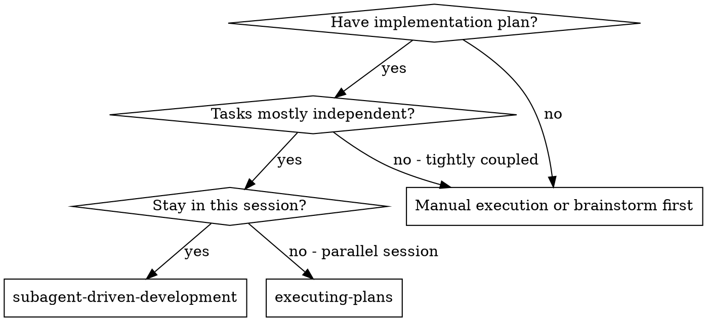
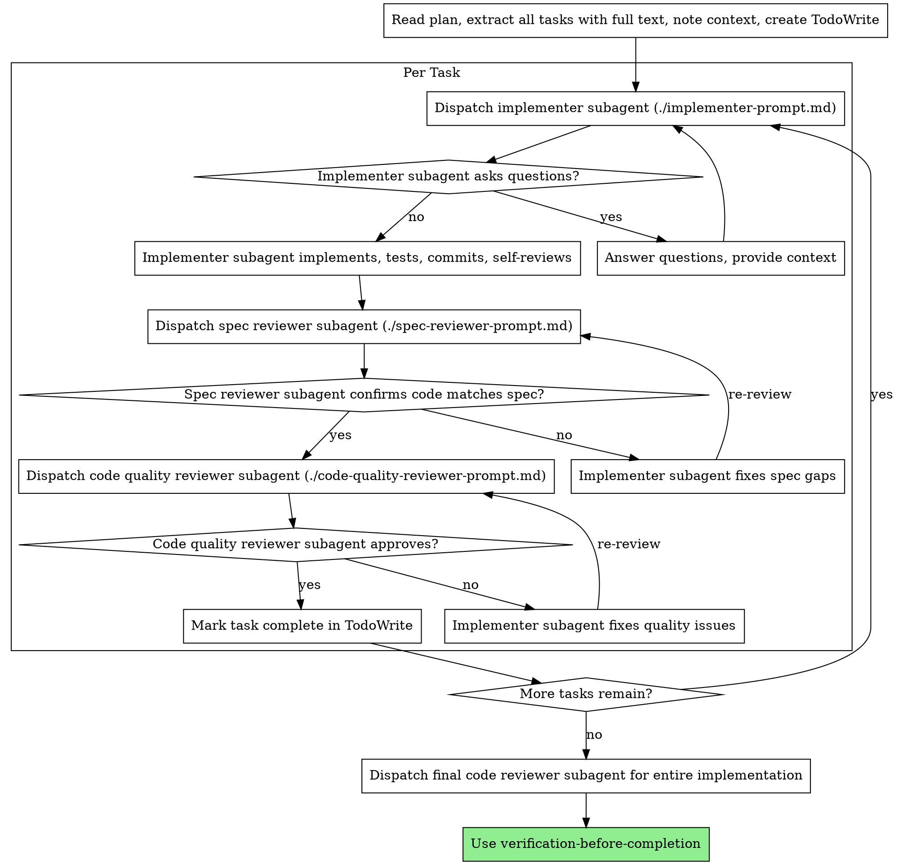

# Subagent 驱动的开发

通过为每个任务派发一个全新的 subagent 来执行 plan，每完成一个任务后进行两阶段评审：先做 spec 合规性评审，再做代码质量评审。

**为什么使用 subagent：** 你把任务委派给具有隔离 context 的专门 agent。通过精确地构造它们的指令和 context，你确保它们专注于任务并取得成功。它们绝不应该继承你当前会话的 context 或历史 —— 你要为它们精确地构造它们所需要的内容。这样也能保护你自己的 context 用于协调工作。

**核心原则：** 每个任务一个全新的 subagent + 两阶段评审（先 spec 后质量）= 高质量、快速迭代

**持续执行：** 不要在任务之间停下来与你的人类伙伴确认。从 plan 中执行所有任务，不要中途停下。仅有的停下理由是：你无法解决的 BLOCKED 状态、确实阻碍进展的歧义，或所有任务已完成。"我应该继续吗？"这样的提示和进度总结会浪费他们的时间 —— 他们让你执行 plan，那就执行它。

## 何时使用



**对比 Executing Plans（parallel 会话）：**
- 同一会话（无 context 切换）
- 每个任务一个全新 subagent（无 context 污染）
- 每个任务后进行两阶段评审：先 spec 合规，再代码质量
- 更快的迭代（任务之间不需要 human-in-loop）

## 流程



## 模型选择

为每个角色使用能够胜任的最弱模型，以节约成本并提升速度。

**机械式实现任务**（孤立的函数、清晰的 spec、1-2 个文件）：使用快速、便宜的模型。当 plan 写得很完善时，大多数实现任务都是机械式的。

**集成与判断类任务**（多文件协调、模式匹配、调试）：使用标准模型。

**架构、设计与评审类任务**：使用最强大的可用模型。

**任务复杂度信号：**
- 涉及 1-2 个文件且具备完整 spec → 便宜的模型
- 涉及多个文件并存在集成方面的考量 → 标准模型
- 需要设计判断或对 codebase 的广泛理解 → 最强大的模型

## 处理 Implementer 的状态

Implementer subagent 会汇报四种状态之一。请相应地处理每一种：

**DONE：** 进入 spec 合规性评审。

**DONE_WITH_CONCERNS：** implementer 完成了工作但标记了疑虑。在继续之前先阅读这些疑虑。如果疑虑涉及正确性或范围问题，则在评审之前先解决它们。如果它们只是观察性意见（例如"这个文件越来越大"），先记录下来并进入评审。

**NEEDS_CONTEXT：** implementer 需要未提供的信息。提供缺失的 context 并重新派发。

**BLOCKED：** implementer 无法完成任务。评估阻塞原因：
1. 如果是 context 问题，提供更多 context 并使用相同的模型重新派发
2. 如果任务需要更多推理，使用更强大的模型重新派发
3. 如果任务过大，将其拆分为更小的部分
4. 如果是 plan 本身有问题，向人类升级

**绝不**忽略升级请求，也不要在不做任何更改的情况下强迫同一个模型重试。如果 implementer 说它卡住了，那一定有什么需要改变。

## Prompt 模板

- `./implementer-prompt.md` - 派发 implementer subagent
- `./spec-reviewer-prompt.md` - 派发 spec 合规性评审 subagent
- `./code-quality-reviewer-prompt.md` - 派发代码质量评审 subagent

## 示例工作流

```
You: I'm using Subagent-Driven Development to execute this plan.

[Read plan file once: docs/superpowers/plans/feature-plan.md]
[Extract all 5 tasks with full text and context]
[Create TodoWrite with all tasks]

Task 1: Hook installation script

[Get Task 1 text and context (already extracted)]
[Dispatch implementation subagent with full task text + context]

Implementer: "Before I begin - should the hook be installed at user or system level?"

You: "User level (~/.config/superpowers/hooks/)"

Implementer: "Got it. Implementing now..."
[Later] Implementer:
  - Implemented install-hook command
  - Added tests, 5/5 passing
  - Self-review: Found I missed --force flag, added it
  - Committed

[Dispatch spec compliance reviewer]
Spec reviewer: ✅ Spec compliant - all requirements met, nothing extra

[Get git SHAs, dispatch code quality reviewer]
Code reviewer: Strengths: Good test coverage, clean. Issues: None. Approved.

[Mark Task 1 complete]

Task 2: Recovery modes

[Get Task 2 text and context (already extracted)]
[Dispatch implementation subagent with full task text + context]

Implementer: [No questions, proceeds]
Implementer:
  - Added verify/repair modes
  - 8/8 tests passing
  - Self-review: All good
  - Committed

[Dispatch spec compliance reviewer]
Spec reviewer: ❌ Issues:
  - Missing: Progress reporting (spec says "report every 100 items")
  - Extra: Added --json flag (not requested)

[Implementer fixes issues]
Implementer: Removed --json flag, added progress reporting

[Spec reviewer reviews again]
Spec reviewer: ✅ Spec compliant now

[Dispatch code quality reviewer]
Code reviewer: Strengths: Solid. Issues (Important): Magic number (100)

[Implementer fixes]
Implementer: Extracted PROGRESS_INTERVAL constant

[Code reviewer reviews again]
Code reviewer: ✅ Approved

[Mark Task 2 complete]

...

[After all tasks]
[Dispatch final code-reviewer]
Final reviewer: All requirements met, ready to merge

Done!
```

## 优势

**对比手动执行：**
- subagent 自然地遵循 TDD
- 每个任务都有全新的 context（不会混乱）
- parallel 安全（subagent 不会相互干扰）
- subagent 可以提问（在工作之前以及工作过程中都可以）

**对比 Executing Plans：**
- 同一会话（无交接）
- 持续推进（无等待）
- 评审检查点自动进行

**效率提升：**
- 没有读取文件的开销（控制者直接提供完整文本）
- 控制者精确策划所需的 context
- subagent 一开始就拿到完整信息
- 在工作开始之前（而非之后）就把问题暴露出来

**质量门：**
- 自审在交接前发现问题
- 两阶段评审：spec 合规，然后代码质量
- 评审循环确保修复确实生效
- spec 合规防止过度/不足实现
- 代码质量确保实现质量过硬

**成本：**
- 更多的 subagent 调用（每个任务一个 implementer + 两个 reviewer）
- 控制者承担更多准备工作（预先抽取所有任务）
- 评审循环增加了迭代次数
- 但能尽早发现问题（比之后调试更便宜）

## 警示信号

**绝不：**
- 在未获得用户明确同意的情况下，在 main/master branch 上开始实现
- 跳过评审（无论是 spec 合规还是代码质量）
- 带着未修复的问题继续推进
- parallel 派发多个实现 subagent（会冲突）
- 让 subagent 自己读 plan 文件（应改为提供完整文本）
- 跳过场景铺垫的 context（subagent 需要理解任务在哪里发挥作用）
- 忽略 subagent 的提问（在让它们继续之前先回答）
- 在 spec 合规上接受"差不多就行"（spec reviewer 发现了问题 = 任务尚未完成）
- 跳过评审循环（reviewer 发现问题 = implementer 修复 = 再评审一次）
- 让 implementer 的自审取代真正的评审（两者都必需）
- **在 spec 合规为 ✅ 之前就开始代码质量评审**（顺序错了）
- 在任一评审仍有未解决问题时就进入下一个任务

**如果 subagent 提问：**
- 清晰、完整地回答
- 必要时提供额外的 context
- 不要催促它们急着进入实现

**如果 reviewer 发现问题：**
- 由 implementer（同一个 subagent）修复
- reviewer 再次评审
- 重复直到通过
- 不要跳过再评审

**如果 subagent 任务失败：**
- 派发修复 subagent，并附上明确的指令
- 不要试图手动修复（会污染 context）

## 集成

**所需的工作流 skill：**
- **superpowers:using-git-worktrees** - 确保隔离的工作区（创建一个或验证已有的）
- **superpowers:writing-plans** - 创建本 skill 所执行的 plan
- **superpowers:requesting-code-review** - 用于 reviewer subagent 的 code review 模板
- **verification-before-completion** - 在声明完成或执行 git 收尾动作前做新鲜验证

**subagent 应使用：**
- **superpowers:test-driven-development** - subagent 在每个任务中遵循 TDD

**替代工作流：**
- **superpowers:executing-plans** - 用 parallel 会话替代同一会话执行
