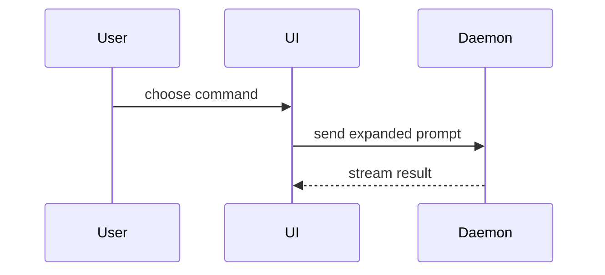

我对这块代码不熟悉。先上升一层抽象，再用项目的领域术语建立相关模块、调用方、状态所有者和边界的地图。帮助用户通过最小、最清楚的视觉结构理解当前代码或架构讨论点。跳过铺垫，保持文字简短。

## 工作方式

### 1. 先建立代码地图

- 确定当前问题的入口、所属模块、相关调用方和被调用方。
- 找出重要的状态或数据所有者，以及与相邻模块、进程、服务或协议的边界。
- 使用项目已有的领域术语和实际文件路径。
- 只读取回答当前问题所需的调用、文件、props、状态和边界；忽略无关目录。
- 区分现有结构、推断关系和建议中的变化，不要把推断当成事实。

### 2. 选择最小的表达形式

根据当前讨论点选择一种或少量组合，不要把所有形式都生成一遍。

#### 逻辑或算法：伪代码

用它表达条件、缓存、持久化或状态变化，不必暴露实现语言细节：

```text
on(save)
  if content is unchanged
    return cached result
  persist content
  invalidate cache
  return fresh result
```

#### 运行时或调用流程：调用树

展示入口到结果的调用顺序，只保留会影响当前问题的调用：

```text
submitForm
  createSession
    persistPrompt
    launchAgent
  navigateToSession
```

#### UI 结构：组件树

标出实际文件、重要 hook、状态和跨模块边界：

```text
<SessionPage> (apps/example/src/routes/session.tsx)
  useSessionEvents()
  <SessionToolbar>
    <RunSkillButton> (packages/ui)
  <SessionTimeline>
```

#### 文件职责或较大的重构：浅层文件树

只展示能说明职责、所有权和变化范围的层级：

```text
src/
├── commands/       # parses user actions
├── sessions/       # owns session state
└── transport/      # sends API requests
```

#### 组件交互、控制流或数据流：Mermaid

选择 sequence、flowchart 或其他合适的 Mermaid 图，保留参与者和关键消息：



#### 已有结构如何变化：diff

当周围结构已经存在且重点是“改了什么”时使用 diff。让 diff 的形状匹配讨论点。

组件变化：

```diff
 <SessionPage>
   useSessionEvents()
   <SessionToolbar>
+    <RunSkillButton />
   <SessionTimeline>
+    <SkillResultCard />
```

文件布局变化：

```diff
 src/
 ├── commands/
+│   └── expand-command.ts
 ├── sessions/
-└── transport.ts
+└── transport/
+    ├── client.ts
+    └── stream.ts
```

调用树变化：

```diff
 submitForm
   createSession
     persistPrompt
+    expandSkillMention
     launchAgent
-  navigateToSession
+  navigateToSession
+  subscribeToEvents
```

状态或控制流变化：

```diff
 on(save)
-  write content
+  if content is unchanged
+    return cached result
+  write content
+  invalidate cache
```

#### 大部分内容是新增，或需要可复制的目标形状：完整代码块

当省略上下文会隐藏所有权或顺序，或者用户需要直接复制的目标结构时，展示完整代码块，而不是勉强制作 diff：

```ts
function expandSkill(command: string): string {
  const skillName = command.slice(1)
  return `use the ${skillName} skill`
}
```

### 3. 视觉 UI 或复杂概念：HTML artifact

如果 UI、布局、状态对比或概念复杂到 Mermaid 和文本图示无法清楚表达，创建一个聚焦的 HTML 文件。根据重点选择以下一种形式：

- diagram：表达结构、关系或流程；
- infographic：表达状态、分层或对比；
- short slide deck：表达需要按顺序展开的复杂概念。

HTML artifact 必须：

- 使用真实标签、数据和当前产品语境；
- 匹配产品已有的颜色、字体、间距和组件；
- 支持桌面端与移动端；
- 聚焦一个问题，不变成完整产品页面。

写完后实际打开 HTML 给用户查看，不要只返回文件路径。使用当前环境可用的文件或浏览器打开方式。

## 输出约束

- 跳过长篇前言，把视觉结构放在它所支持的简短文字旁边。
- 只保留回答当前问题或帮助解决当前讨论点所需的调用、文件、props、状态和边界。
- 一个视图足够时不要组合多个；只有在不同视图分别说明不同关系时才组合。
- 不要为了展示技巧而生成视觉结构；视觉结构必须让所有权、顺序、变化或关系更容易理解。
- 需要时明确标注文件路径、模块边界和哪些部分是建议中的变化。
